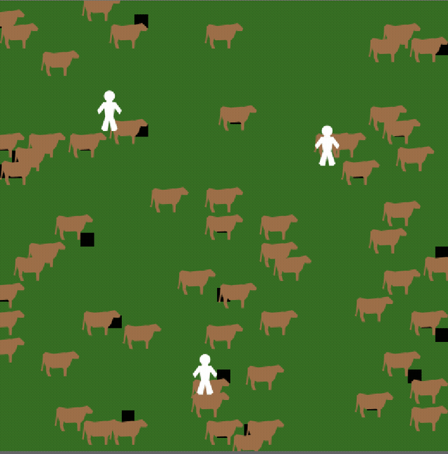

# MASTOC-LLM

**Multi-Agent System Tragedy of the Commons — with Large Language Model Agents**

> 
> Extending [MASTOC v1.1.0](https://www.comses.net/codebases/2283/releases/1.1.0/) (Schindler, 2013)

---

## What is this?

MASTOC-LLM replaces the rule-based agents in the classic MASTOC commons model with agents powered by large language models (LLMs). Instead of choosing actions via a Nash-equilibrium payoff calculator, each agent reads the state of the shared grassland, observes its neighbors' behavior, recalls a rolling memory of past rounds, and — critically — **communicates with its neighbors in natural language** before deciding whether to add, keep, or remove a cow.

The core research question:

> *Do Ostrom-style commons institutions — norms, coordination, sanctioning — emerge spontaneously from language-capable agents under resource pressure?*



---

## Contents

- [Background](#background)
  - [Ostrom's Design Principles — applicability to this model](#ostroms-design-principles--applicability-to-this-model)
- [How it works](#how-it-works)
- [Glossary](#glossary)
  - [Acronyms and abbreviations](#acronyms-and-abbreviations)
  - [Model parameters and variables](#model-parameters-and-variables)
  - [How personality parameters reach the LLM](#how-personality-parameters-reach-the-llm)
  - [The cost function and grassland dynamics](#the-cost-function-and-grassland-dynamics)
  - [Collapse patterns](#collapse-patterns)
  - [Ostrom framework](#ostrom-framework)
- [Experimental conditions](#experimental-conditions)
- [Preliminary results](#preliminary-results)
  - [Summary table](#summary-across-conditions)
  - [Baseline: the tragedy unfolds — and what it takes to stop it](#baseline-the-tragedy-unfolds--and-what-it-takes-to-stop-it)
  - [Full-GABM: cooperative convergence](#full-gabm-cooperative-convergence)
  - [Hybrid: the limits of a single institutional entrepreneur](#hybrid-the-limits-of-a-single-institutional-entrepreneur)
  - [Hybrid (2 LLM): coalition formation, delayed tragedy](#hybrid-2-llm-coalition-formation-delayed-tragedy)
  - [Hybrid (LLM-advantaged): herd position doesn't matter](#hybrid-llm-advantaged-herd-position-doesnt-change-structural-outcome)
  - [Full-GABM (low guilt + low envy): fairness parameters shape cooperation quality](#full-gabm-low-guilt--low-envy-fairness-parameters-shape-cooperation-quality)
  - [Full-GABM (low cooperation): cooperation robust to personality framing](#full-gabm-low-cooperation-cooperation-is-robust-to-personality-framing)
  - [Scarce commons: rapid recovery across personality conditions](#scarce-commons-rapid-recovery-across-personality-conditions)
  - [Full-GABM (Llama 3.2 3B): cooperative surface, no institutional depth](#full-gabm-llama-32-3b-cooperative-surface-no-institutional-depth)
  - [gpt-5.4-mini: cooperative stasis and paralysis](#gpt-54-mini-cooperative-stasis-and-paralysis)
  - [gpt-5.5: cooperation level governs fate](#gpt-55-cooperation-level-governs-fate-model-can-succeed-or-collapse-from-the-same-starting-point)
  - [DeepSeek R1:32b: reasoning model, KEEP-dominant behavior](#deepseek-r132b-reasoning-model-keep-dominant-behavior)
  - [gemma4:e4b: KEEP-dominant stasis, then overshoot-panic at mid cooperation](#gemma4e4b-keep-dominant-stasis-then-overshoot-panic-at-mid-cooperation)
  - [Claude Sonnet: mid cooperation and high negative reciprocity](#claude-sonnet-mid-cooperation-and-high-negative-reciprocity)
  - [Cross-model comparison: neg\_r = 1](#cross-model-comparison-neg_r--1-with-gpt-55-produces-stability-but-not-equality)
  - [Memory and communication sweep: amnesiac vs. equipped agents](#memory-and-communication-sweep-amnesiac-vs-equipped-agents)
  - [Memory=1: delayed collapse via coordination without trend detection](#memory1-delayed-collapse-via-coordination-without-trend-detection)
  - [Memory=3: fragile survival at the threshold](#memory3-fragile-survival-at-the-threshold)
  - [Claude Haiku: memory × communication interaction](#claude-haiku-memory--communication-interaction)
  - [Memory=2: oscillating dynamics and the stochastic boundary](#memory2-oscillating-dynamics-and-the-stochastic-boundary)
- [Collapse pattern taxonomy](#collapse-pattern-taxonomy)
  - [Pattern I — Cooperative Paralysis](#pattern-i--cooperative-paralysis)
  - [Pattern II — Defection Cascade](#pattern-ii--defection-cascade)
  - [Pattern III — Overshoot-Panic](#pattern-iii--overshoot-panic)
  - [Pattern IV — Hybrid Architecture Failure](#pattern-iv--hybrid-architecture-failure)
- [Repository structure](#repository-structure)
- [Quick start](#quick-start)
- [Working hypotheses and proposed experiments](#working-hypotheses-and-proposed-experiments)
  - [H1: Cooperation threshold](#h1--coop--049-is-a-tragedy-producing-threshold-consistent-across-models)
  - [H2: High coop necessary but not sufficient](#h2--high-cooperation-is-necessary-but-not-sufficient-fair_oth-and-neg_r-determine-whether-stasis-paralysis-or-institution-emerges)
  - [H3: Negative reciprocity as paralysis antidote](#h3--negative-reciprocity-is-a-cooperative-paralysis-antidote)
  - [H4: Stressed starting conditions amplify differentiation](#h4--stressed-starting-conditions-amplify-cooperative-differentiation)
  - [H5: Explicit thresholds cure paralysis](#h5--cooperative-paralysis-is-a-prompt-engineering-artifact-curable-by-explicit-thresholds)
  - [H6: Model capability predicts failure mode](#h6--model-capability-predicts-cooperative-failure-mode-smaller-models-default-to-keep-larger-to-add)
  - [H7: Memory window is a prerequisite for trend detection and commons stability](#h7--there-is-a-minimum-memory-window-for-commons-stability-below-it-correct-norms-become-unreachable-holding-patterns)
  - [Open questions](#open-questions)
- [Citations](#citations)
- [Status](#status)

---

## Background

The [Tragedy of the Commons](https://en.wikipedia.org/wiki/Tragedy_of_the_commons) (Hardin, 1968) predicts that rational self-interest leads to collective over-exploitation of shared resources. Ostrom (1990) challenged this, showing that real communities often self-organize governance institutions — rules, monitoring, graduated sanctions — without top-down intervention.

MASTOC (Schindler, 2013) is a NetLogo ABM that reproduces the tragedy under classical rational-agent assumptions. MASTOC-LLM asks: what happens when agents can reason, remember, and talk?

### Ostrom's Design Principles — applicability to this model

Ostrom (1990) identified eight design principles shared by long-lived, self-governing commons institutions. The table below maps each principle to its status in MASTOC-LLM. The key experimental levers — `memory_length` and `communication?` — directly control whether the emergent principles are possible at all.

| # | Principle | Status | Observable signal |
|---|-----------|--------|-------------------|
| DP1 | **Clear boundaries** — who may use the resource is well-defined | ✅ Baked in by design | Fixed 3-agent structure; no entry/exit dynamics |
| DP2 | **Rules fit local conditions** — appropriation rules match the specific resource context | 🟡 Partially emergent | Agents adapt personal thresholds to current pool %; not negotiated collectively |
| DP3 | **Collective choice** — those affected by the rules participate in modifying them | 🔬 Experimentally variable | Norm proposals and threshold agreements in agent messages — *only possible when `communication?` is on* |
| DP4 | **Monitoring** — resource state and user behavior are observable | ✅ Baked in by design | Pool % is globally visible every tick; a structural advantage real commons rarely have |
| DP5 | **Graduated sanctions** — rule-breakers face escalating consequences applied by peers | 🔬 Experimentally variable | Social pressure via messages ("you should reduce"); true enforcement absent — itself a finding. *Only possible when `communication?` is on* |
| DP6 | **Conflict resolution** — low-cost mechanisms for dispute resolution exist | ❌ Not present | No arbitration mechanism; disagreements play out through action choices alone |
| DP7 | **External recognition** — outside authorities recognize the community's right to self-govern | ➖ Not applicable | Single-environment lab model; no external authority modeled |
| DP8 | **Nested governance** — institutions are organized in nested layers for larger systems | ➖ Not applicable | 3-agent model; no hierarchy to nest |

The primary contribution of this project is to DP3 and DP5: testing whether language-capable agents spontaneously reconstruct collective choice and graduated sanctions under resource pressure, and identifying the conditions (`memory_length`, `communication?`) that make this possible.

---

## How it works

```
NetLogo (MASTOC-LLM.nlogo)
        │  per-tick context (pool state, herd sizes, payoffs, messages)
        ▼
Python bridge (mastoc_llm_bridge.py)
        │  LLM prompt + rolling memory + inbox messages
        │  (per-agent backend and model — agents can differ)
        ▼
LLM API  ←  Anthropic | OpenAI | Google | Ollama (local)
        │  JSON response: { action, message, reasoning }
        ▼
NetLogo  ←  action (−1 / 0 / +1)  +  outgoing message → neighbors
```

Each tick, every LLM agent:
1. Receives the current pool health, own herd size, neighbor herd sizes and last actions, and estimated payoffs for each possible action
2. Reads its rolling memory of past rounds (configurable via `memory_length`, default 5; 0 = no memory)
3. Reads any messages sent by neighbors this round (suppressed when `communication?` is off)
4. Calls the LLM, which returns a structured JSON decision with reasoning and an optional 60-word message to send to neighbors
5. Acts on the decision; the message is delivered to all neighbors before their next decision (no-op when `communication?` is off)

A secondary LLM pass runs every 5 ticks to classify agent messages for Ostrom institutional signals (norm proposals, sanctions, coordination, trust-building, defection).

---

## Glossary

### Acronyms and abbreviations

| Term | Definition |
|------|------------|
| **ABM** | Agent-Based Model — a computational model in which individual agents follow local rules and interact to produce emergent system-level behavior |
| **CPR** | Common-Pool Resource — a resource that is *rivalrous* (one person's use reduces availability for others) but *non-excludable* (difficult to prevent access); Ostrom's unit of analysis |
| **GABM** | Generative Agent-Based Model — an ABM in which agents are powered by generative AI (LLMs) rather than hand-coded rules; the approach developed in Jimenez-Romero et al. (2025) and extended here |
| **LLM** | Large Language Model — a neural language model (e.g. Claude, GPT-5.5, Llama) used here to generate agent decisions, reasoning, and natural-language messages |
| **MASTOC** | Multi-Agent System Tragedy of the Commons — the original NetLogo model (Schindler, 2013) on which this project is based |
| **MASTOC-LLM** | This project — MASTOC extended with LLM-powered agents |
| **Post-training** | The full set of techniques applied *after* pre-training (next-token prediction on raw text) to make a model useful, safe, and aligned with human intent. Typically begins with **SFT** (Supervised Fine-Tuning on curated instruction/dialogue examples), followed by one or more alignment techniques such as RLHF, Constitutional AI, DPO, or GRPO (see entries below). The specific post-training objective — what behaviors are rewarded and how — shapes the model's emergent capabilities in ways that may extend well beyond the intended task. Our results suggest post-training objective may be a meaningful predictor of commons-governance capacity in GABM settings, though this hypothesis is untested. |
| **RLHF** | Reinforcement Learning from Human Feedback — the dominant post-training alignment technique ([Christiano et al., 2017](https://arxiv.org/abs/1706.03741)). Human evaluators compare pairs of model outputs; their preferences train a reward model, which guides further policy optimisation. Because the reward signal reflects what humans prefer — helpfulness, social nuance, cooperative framing — it may incidentally shape social-coordination capacities that extend beyond the intended training objective. Anthropic's variant, **Constitutional AI**, adds a self-critique loop against a written set of principles ([Bai et al., 2022](https://arxiv.org/abs/2212.08073)). Citations for specific model training approaches appear in the relevant results sections. |
| **GRPO** | Group Relative Policy Optimisation — an alternative post-training alignment algorithm used by DeepSeek R1 ([DeepSeek AI, 2025](https://arxiv.org/abs/2501.12948)). Unlike RLHF, GRPO does not train a separate reward model from human preferences. Instead, for each prompt it generates a *group* of candidate outputs, scores them using a rule-based verifier (e.g. checking mathematical correctness), and updates the policy based on each output's performance *relative to the others in its group*. Because GRPO was designed to optimise for reasoning correctness — maths, code, logic — rather than social responsiveness, it may produce a different profile of emergent social capabilities than RLHF. **The hypothesis that GRPO vs. RLHF post-training explains observed GABM differences is speculative and untested; it is a proposed direction for future work, not an established finding.** |

---

### Model parameters and variables

The following parameters are set in the NetLogo interface before each run and logged in `run_meta.json`.

| Parameter | Symbol | Range | Description |
|-----------|--------|-------|-------------|
| `cooperation_level` | α_c | [0, 1] | How much agents weight collective vs. individual outcomes. At 0, the agent's prompt frames it as purely self-interested; at 1, it is framed as prioritizing the group's total earnings |
| `fairness_concerning_me` | α_f | [0, 1] | Envy weight — disutility experienced when others earn *more* than the agent (Fehr & Schmidt, 1999) |
| `fairness_concerning_others` | β_f | [0, 1] | Guilt weight — disutility experienced when the agent earns *more* than others |
| `positive_reciprocity` | ρ_+ | [0, 1] | Strength of reward-for-cooperation: agents applying this parameter gain additional utility from REMOVE when neighbors previously REMOVED |
| `negative_reciprocity` | ρ_− | [0, 1] | Strength of punishment-for-defection: agents applying this parameter gain additional utility from ADD when neighbors previously ADDED; also activates social sanctioning language in messages |
| `risk_aversion_level` | — | [0, 1] | Not yet systematically varied; modulates how conservatively agents interpret payoff uncertainty |
| `initial_grassland` | V_0 | [0, 100] | Starting pool health as percentage of maximum vegetation patches |
| `initial_grass_growth_rate` | r | (0, 1) | Logistic growth rate of the grassland (default: 0.001) |
| `cow_forage_requirement` | f | ≥ 1 | Grass patches each cow consumes per tick (default: 2) |
| `memory_length` | — | ≥ 0 | Number of past rounds included in each agent's rolling memory (default: 5); 0 = amnesiac agents with no history |
| `communication?` | — | on / off | When off, suppresses all inter-agent messaging — agents decide from resource state and memory alone, with no outgoing messages and incoming inboxes cleared |
| `num-llm-agents` | — | 1–3 | Number of LLM agents in hybrid condition |

**State variables (updated each tick):**

| Variable | Symbol | Description |
|----------|--------|-------------|
| `ki` | k_i | Current herd size of agent i (number of cows) |
| `K` | K | Total cows across all agents: K = Σ k_i |
| `Veg` | V | Current number of green grass patches |
| `pressure` | — | Grazing pressure: bare patches / total patches |
| `xi` | x_i | Agent i's action this tick: +1 (ADD), 0 (KEEP), −1 (REMOVE) |
| `d` | d | Net herd change: d = Σ x_i |

---

### How personality parameters reach the LLM

The personality sliders do not feed into a utility formula that the simulation computes. Instead, the Python bridge (`mastoc_llm_bridge.py`) translates each parameter's value into a plain-English personality trait that is included in the agent's system prompt. The LLM reads this description and makes decisions accordingly — the behavioral logic lives in language, not in equations.

The translation works as a set of threshold checks. For each parameter, a trait phrase is added to the agent's personality description when the value crosses 0.5 (or 0.3 for self-interest). The resulting description is injected into the prompt as a single sentence:

| Parameter value | Phrase added to prompt |
|----------------|------------------------|
| `cooperation_level` > 0.6 | *"cooperative — values collective outcomes over personal gain"* |
| `cooperation_level` < 0.3 | *"self-interested — focused primarily on personal profit"* |
| `fairness_concerning_me` > 0.5 | *"envious — bothered when others earn more than you"* |
| `fairness_concerning_others` > 0.5 | *"guilt-averse — uncomfortable earning much more than others"* |
| `positive_reciprocity` > 0.5 | *"reciprocal — you reward neighbors who reduce their herds"* |
| `negative_reciprocity` > 0.5 | *"retaliatory — you punish neighbors who expand their herds"* |
| `risk_aversion_level` > 0.5 | *"risk-averse — you prefer safer outcomes over risky high payoffs"* |

A run at default settings (coop=1, fairness=0.5, neg_r=0, pos_r=0) would produce: *"cooperative — values collective outcomes over personal gain; guilt-averse — uncomfortable earning much more than others."*

Alongside the personality description, each agent also receives three numerical payoff estimates — the expected net gain from adding a cow, keeping the herd steady, or removing a cow — computed by NetLogo from current grass levels and herd sizes. These give the LLM a quantitative signal about the current state of the commons without requiring it to derive the numbers itself.

---

### The cost function and grassland dynamics

The following equations describe what NetLogo actually computes each tick — the payoff estimates passed to the LLM and the grass regrowth that drives resource dynamics. This is the simulation's numerical core; the personality system above sits on top of it.

**Cost function** — the opportunity cost of changing herd size:

$$C(K, K') = \frac{G(V - K \cdot f) - G(V - K' \cdot f)}{f \cdot n} \cdot P$$

where G(v) is the *next-tick* grass level at vegetation level v:

$$G(v) = \max(0,\; v) \cdot \left[1 + r \cdot v \cdot \left(1 - \frac{v}{V_{\max}}\right)\right]$$

V_max = 1089 (the 33 × 33 patch grid). The cost function captures the marginal impact of adding or removing cows on the resource's next-period recovery — the mechanism through which herd decisions propagate to the commons.

**Grass regrowth** — logistic dynamics:

$$V(t+1) = V(t) + r \cdot V(t) \cdot \left(1 - \frac{V(t)}{V_{\max}}\right) - \sum_i k_i \cdot f$$

Each tick, cows graze first (each consuming f patches), then surviving grass regrows logistically. Cows that cannot find f patches die.

---

### Collapse patterns

Four distinct trajectories to commons collapse have been identified in this dataset. See the [Collapse pattern taxonomy](#collapse-pattern-taxonomy) section for full descriptions.

| Pattern | Trigger | Signature |
|---------|---------|-----------|
| **Cooperative Paralysis** | High cooperation + vague conditional commitments | All KEEP while pool drains; REMOVE triggered too late |
| **Defection Cascade** | Low cooperation + mutual-ADD equilibrium | All ADD every tick; pool exhausted in 10–14 ticks |
| **Overshoot-Panic** | Mid cooperation + stressed start | ADD phase → belated KEEP/REMOVE → collapse |
| **Hybrid Architecture Failure** | Structural mismatch: LLM + rule-based agents | LLM cooperates and appeals; rule-based agents add unchecked |

---

### Ostrom framework

Key terms from Ostrom (1990), *Governing the Commons*, as used in this paper.

| Term | Definition |
|------|------------|
| **Common-Pool Resource (CPR)** | A resource that is rivalrous and non-excludable — excludable enough that exclusion is costly, rivalrous enough that overuse is possible. The grassland in MASTOC is a CPR |
| **Appropriation** | Withdrawal of resource units from a CPR. In MASTOC: adding cows (each cow consumes grass units per tick) |
| **Provision** | Maintenance of or investment in a CPR. In MASTOC: removing cows (reducing pressure on the grassland) |
| **Second-order collective action problem** | The problem of enforcing rules about commons use — who monitors, who sanctions, and who bears the cost of doing so |
| **Design principles** | Eight structural features observed in long-surviving CPR institutions (Ostrom, 1990, pp. 90–102). See the table below |
| **Graduated sanctions** | Penalties for rule violations that escalate with repeat offences — starting with low-cost social censure and rising to exclusion. Partially operationalised here via `negative_reciprocity`, which works at two levels: (1) a behavioral tendency to match a neighbour's ADD with an ADD of your own (retaliatory defection rather than true peer sanctioning), and (2) activation of social sanctioning language in messages when communication is on. The second level is closer to Ostrom's intent; the first is a proxy. True graduated sanctions — where one agent imposes an escalating cost *on another* — are not structurally enforceable in this model, and that gap is itself a finding. |
| **Monitoring** | Active observation of both resource condition and other users' behavior by participants or designated monitors |
| **Operational rules** | Day-to-day rules governing who may appropriate, how much, and when. Distinguished from *collective choice rules* (who may change the operational rules) and *constitutional rules* (who may change the collective choice rules) |
| **Proportional equivalence** | Design principle 2 — rules distributing costs and benefits should be proportional to each user's situation. Operationalized here as `fairness_concerning_others` |
| **Polycentric governance** | Multiple overlapping governance systems at different scales; the broader framework Ostrom developed beyond the eight principles |
| **Institutional entrepreneur** | An actor who incurs personal costs to build or maintain collective institutions; corresponds to the cooperative LLM agent in hybrid conditions |

**Ostrom's eight design principles**, as referenced in this paper:

| # | Principle | Relevance to MASTOC-LLM |
|---|-----------|------------------------|
| 1 | Clearly defined boundaries | Fixed in our model (3 agents, closed grassland) |
| 2 | Proportional equivalence between costs and benefits | Tested via `fairness_concerning_others` |
| 3 | Collective choice arrangements (users participate in rule-making) | Tested in H5: do specific operational rules prevent paralysis? |
| 4 | Monitoring of resource and users | Operationalized by agents observing pool health and neighbor actions each tick |
| 5 | Graduated sanctions | Tested via `negative_reciprocity`; activated in H3 |
| 6 | Conflict resolution mechanisms | Emergent in 2-LLM hybrid (coalition ultimatums); absent in 1-LLM hybrid |
| 7 | Minimal recognition of rights to organize | Fixed: all LLM agents have equal standing |
| 8 | Nested enterprises | Not tested; relevant to future multi-scale extensions |

---

## Experimental conditions

| Condition | Agents | Description |
|---|---|---|
| **baseline** | 3 rule-based | Myopic best-response heuristic — reproduces classical tragedy |
| **full-gabm** | 3 LLM | All agents use language reasoning and communication |
| **hybrid** | mix of LLM + rule-based | Controlled by `num-llm-agents` slider — 1, 2, or 3 LLM agents paired with rule-based agents |

The `num-llm-agents` slider sets the number of LLM-reasoning agents directly (1, 2, or 3). Setting it to `1` gives 1 LLM + 2 rule-based; `2` gives 2 LLMs + 1 rule-based.

Each agent's backend and model are independently configurable. Any mix of Anthropic, OpenAI, Google Gemini, and local Ollama models can be run simultaneously in the same simulation — enabling direct cross-model comparisons within a single run.

---

## Preliminary results

> ⚠️ These are single-run results from an ongoing experiment. Replications and full statistical analysis are in progress.

Four distinct collapse trajectories appear across these runs — **Pattern I (Cooperative Paralysis)**, **Pattern II (Defection Cascade)**, **Pattern III (Overshoot-Panic)**, and **Pattern IV (Hybrid Architecture Failure)** — and are described in detail in the [Collapse pattern taxonomy](#collapse-pattern-taxonomy) section. Individual run narratives reference these patterns where relevant.

**Convergence is highly parameter-dependent.** The runs below span a wide range of outcomes: cooperative convergence, delayed collapse, oscillating dynamics, and immediate tragedy. The first full-GABM results documented here used high-cooperation default settings (coop=1, memory_length=5, communication=on), which reliably produce cooperative outcomes across models. Subsequent parameter sweeps tell a more mixed story.

Mid-level cooperation (coop≈0.5) consistently collapsed in the runs tested — six independent runs across two models — and short memory windows (memory_length ≤ 1) produced collapse in the mid-cooperation regime (memory=1, coop=0.5: collapse at tick 87; memory=0, coop=0.5: collapse at tick 31). 

High-cooperation runs with short memory windows that have been logged so far did *not* collapse over their 10–50 tick horizons, but those runs are too short to draw a firm conclusion. 

A meaningful fraction of full-GABM runs in this dataset end in collapse, with the highest collapse rates concentrated in the mid-cooperation parameter region. The cooperative-convergence cases shown first are not the modal outcome across the full parameter space — they represent performance under near-ideal conditions.

### Summary across conditions

| Condition | Model | LLMs | Collapse? | Collapse tick | Key finding |
|-----------|-------|------|-----------|---------------|-------------|
| **Baseline** | — | 0 | Yes | ~36 | Classical tragedy reproduced |
| **Full-GABM** | Claude Sonnet 4.6| 3 | No | — | **coop=1, fair_me=0, fair_oth=1, memory=5, comm=on (defaults):** cooperative convergence to 13/13/13; institution score 10/10 by tick 91 |
| **Full-GABM (low cooperation)** | Claude Sonnet 4.6| 3 | No | — | **coop=min, fair_me=0, fair_oth=1, memory=5, comm=on:** self-interested framing yields *faster* convergence (tick 16) to higher-yield 20/20/20; cooperation robust to personality override |
| **Full-GABM (low guilt + low envy)** | Claude Sonnet 4.6| 3 | No | — | **coop=1, fair_me=0, fair_oth=0, memory=5, comm=on:** fairness parameters zeroed; repeated defection, slow convergence (~tick 107), higher herd load (84 cows), commons stressed to 86.7% |
| **Hybrid (1 LLM)** | Claude Sonnet 4.6| 1 | Yes | 35 | **coop=1, fair_me=0, fair_oth=1, memory=5, comm=on (defaults):** one LLM cannot shift the equilibrium alone |
| **Hybrid (2 LLM)** | Claude Sonnet 4.6| 2 | Yes | 58 | **coop=1, fair_me=0, fair_oth=1, memory=5, comm=on (defaults):** coalition formed, tragedy delayed 23 ticks, but overwhelmed by one defector |
| **Full-GABM (Llama 3.2 3B)** | Llama 3.2 3B | 3 | No | — | **coop=1, fair_me=0, fair_oth=1, memory=5, comm=on:** pool maintained at 99.4% but herds oscillated without convergence; cooperative messaging but no institution formation |
| **Full-GABM (Llama 3.2 3B, scarce commons)** | Llama 3.2 3B | 3 | No | — | **coop=1, fair_me=0, fair_oth=1, memory=5, initial_grassland=48%, comm=on:** pool recovered 48%→99% by tick 17; herds oscillated without convergence throughout all 51 ticks |
| **Hybrid (LLM-advantaged initial herd)** | Claude Sonnet 4.6 | 1 | Yes | 33 | **coop=1, fair_me=0, fair_oth=1, memory=5, comm=on; Agent 1 (LLM) starts with 40 cows:** voluntarily reduces to 25 by collapse; rule-based agents add unchecked; collapse 2 ticks earlier than baseline hybrid |
| **Full-GABM (scarce commons, default fairness)** | Claude Sonnet 4.6 | 3 | No | — | **coop=1, fair_me=0, fair_oth=1, memory=5, initial_grassland=49%, comm=on:** pool recovered 49%→99% by tick 10; converged to [11,12,13] by tick 30 |
| **Full-GABM (scarce commons, low coop + low fairness)** | Claude Sonnet 4.6 | 3 | No | — | Initial grassland 50%, coop=0.3, fairness=0: recovery to 99% by tick 20; converged to [12,14,16] by tick 30 |
| **Full-GABM (cooperative stasis)** | gpt-5.4-mini | 3 | No | — | coop=1, fair_me=0, fair_oth=1, memory=5, forage=2: all KEEP for 36 ticks; herds frozen at starting values (6/15/25); pool stable at 99%+; no equalization |
| **Full-GABM (universal stasis)** | gpt-5.4-mini | 3 | No | — | coop=1, fair_me=0.5, fair_oth=0.5, memory=5, initial=50%: all 90 decisions are KEEP — zero ADD or REMOVE; herds 5/15/25 unchanged through tick 30; pool 99.1%. More rigid than cooperative stasis |
| **Full-GABM (cooperative paralysis)** | gpt-5.4-mini | 3 | Yes | 26 | coop=1, fair_me=1, fair_oth=0.5, memory=5, forage=4: KEEP-lock for 24 ticks while pool drained 95.8%→8.5%; REMOVE attempted at tick 25 — one tick too late; fast drain driven by forage=4 |
| **Full-GABM (asymmetric growth)** | gpt-5.4-mini | 3 | No (declining) | — | coop=1, fair_me=1, fair_oth=0.5, memory=5, forage=2: Agent 0 (5 cows) KEEP-locked all 39 ticks; Agents 1+2 add 14 and 12 times → herds grow 15→27 and 25→33; pool declining (95.8% at tick 39); no collapse but trajectory unsustainable |
| **Full-GABM (scarce commons, high coop)** | gpt-5.5 | 3 | No | — | coop=1, fair_me=1, fair_oth=0.11, initial pool 48%: immediate cooperative restraint; 23/23/23 by tick 46; pool recovered to 95.9% |
| **Full-GABM (low cooperation)** | gpt-5.5 | 3 | Yes | 13 | coop=0.13: defection cascade — all ADD every tick from tick 1; pool exhausted in 13 ticks from 49.4% |
| **Full-GABM (mid cooperation, x4 replications)** | gpt-5.5 | 3 | Yes (4/4) | 16–40 | coop=0.49: overshoot-panic — ADD phase from stressed start, collective REMOVE too late; consistent tragedy across all 4 runs |
| **Full-GABM (mid cooperation)** | Claude Sonnet 4.6 | 3 | Yes | 37 | coop=0.49: overshoot-panic matching gpt-5.5 — mid-level cooperation produces tragedy regardless of model |
| **Full-GABM (high coop + high negative reciprocity)** | Claude Sonnet 4.6 | 3 | No | — | coop=1, neg_r=1: equalized to 16/16/16 by tick 18 — fastest convergence observed; explicit accountability enforcement in agent messages |
| **Full-GABM (high coop + high negative reciprocity)** | gpt-5.5 | 3 | No | — | coop=1, neg_r=1: stable at 12/21/22 by tick 17; tit-for-tat escalation cycles before de-escalation; pool stable at 98.2% — same parameters, different institutional character than Claude |
| **Full-GABM (memory=0, no communication)** | Claude Sonnet 4.6 | 3 | Yes | 31 | coop≈0.5, memory_length=0, communication=off: amnesiac agents with no messaging — textbook overshoot-panic in 31 ticks; ADD=71, KEEP=19, REMOVE=6 |
| **Full-GABM (memory=15, communication on)** | Claude Sonnet 4.6 | 3 | No | — | coop≈0.5, memory_length=15: pool stabilized at 95% for 70+ ticks; converged to 24/24/24; agents enforced explicit 93–96% threshold norm via messages |
| **Full-GABM (memory=1, communication on)** | Claude Sonnet 4.6 | 3 | Yes | 87 | coop≈0.5, memory_length=1: delayed collapse — pool recovered to 95% then drained while agents held a 90% target they couldn't detect was unreachable; Pattern I variant |
| **Full-GABM (memory=2, communication on)** | Claude Sonnet 4.6 | 3 | No (oscillating) | — | coop≈0.5, memory_length=2: oscillating grow/correct cycles; achieved 25/25/25 equalization at tick 75; new growth phase began at tick 111; pool declining at termination (90.2%); highly variable across replications |
| **Full-GABM (memory=3, communication on)** | Claude Sonnet 4.6 | 3 | No | — | coop≈0.5, memory_length=3: survived 120 ticks; pool slowly declining (90.1% at end); herds stable at 81 total — fragile, trending toward collapse |
| **Full-GABM (memory=5, comm on)** | Claude Haiku 4.5 | 3 | Yes | 99 | coop≈0.5, memory_length=5, comm=on, initial=52%: initial recovery to 99%, then overshoot-panic; herds reached 67 total by tick 45, pool crashed; ADD=57, KEEP=231, REMOVE=9 |
| **Full-GABM (memory=15, comm on)** | Claude Haiku 4.5 | 3 | No | — | coop≈0.5, memory_length=15, comm=on, initial=52%: survived 120 ticks; converged to 24/24/24; pool stable at 95% — same outcome as Claude Sonnet memory=15 |
| **Full-GABM (memory=15, comm off)** | Claude Haiku 4.5 | 3 | Yes | 46 | coop≈0.5, memory_length=15, comm=off, initial=52%: rapid collapse — herds grew unchecked to 88 total by tick 45, pool 14.7%→0%; ADD=55, KEEP=72, REMOVE=17; memory alone insufficient without communication |
| **Full-GABM (DeepSeek stasis, neg_r=0)** | DeepSeek R1:32b | 3 | No (stalling) | — | coop=1, neg_r=0, memory=5, comm=on: near-universal KEEP in 7 ticks before run interrupted; herds 5/15/26→6/15/26; pool 99%; cooperative messaging but no equalization |
| **Full-GABM (DeepSeek slow drift, neg_r=1)** | DeepSeek R1:32b | 3 | No (stalling) | — | coop=1, neg_r=1, memory=5, comm=on: 46 ticks; KEEP-dominant (ADD=13, KEEP=151, REMOVE=1); herds crept 5/15/25→6/19/30; pool 98.2%; no equalization, no institution formation — matches gpt-5.4-mini stasis pattern |
| **Full-GABM (DeepSeek 55-tick confirmation)** | DeepSeek R1:32b | 3 | No (stalling) | — | coop=1, comm=off: 55 ticks; ADD=13, KEEP=151, REMOVE=1; herds barely drifted 5/15/25→6/20/31; pool 97.9%; KEEP-dominance confirmed as robust across extended runs with no communication |
| **Full-GABM (gemma4 KEEP-dominant)** | gemma4:e4b | 3 | No (stalling) | — | coop=1, grass=90%, comm=off: zero ADD or REMOVE across all 11 ticks; herds frozen at initial values [14,40,5]; pool 97.6%; most extreme stasis observed — not even the large initial inequality triggers equalization |
| **Full-GABM (gemma4 overshoot-panic)** | gemma4:e4b | 3 | Yes | 46 | coop=0.5, grass=50%, comm=off: classic overshoot-panic — pool climbed 52%→95% through tick 20 then reversed as herds grew unchecked to [27,43,39]; collapse tick 46; Agent actions ADD=115, KEEP=133, REMOVE=43; matches coop=0.49 threshold seen in Sonnet and gpt-5.5 |
| **Baseline (growth rate threshold sweep)** | — | 0 | Threshold | ~93 | grass=41%, forage=2: growth ≤ 0.0055 → always collapse (tick 84–97); growth ≥ 0.006 → always stable (pool 100%, herds 80–120 each). 15 replications at growth=0.0051 all collapse at exactly tick 94 — baseline is fully deterministic at risk_aversion=0 |
| **Baseline (risk aversion delay)** | — | 0 | Yes | 24–39 | grass=51%, growth=0.001: risk=0 → collapse tick 24; risk=0.45 → tick 28; risk=1 → tick 39; risk aversion delays but cannot prevent collapse when growth is insufficient |

---

### Baseline: the tragedy unfolds — and what it takes to stop it

The baseline condition uses rule-based best-response agents: pure payoff maximizers with no language, memory, or social signaling. Each tick they choose whichever action (ADD / KEEP / REMOVE) yields the highest expected payoff given current grass levels — with a small stochastic noise term if `risk_aversion_level` > 0. No other personality slider has any effect on baseline decisions.

**Important:** the sociopsychological parameters (cooperation level, fairness weights, reciprocity) do not influence baseline agent behavior. They are parameters of the LLM prompt system and have no code path into the rule-based heuristic. Only `risk_aversion_level` has any effect on baseline agents, and even that is modest (see below).

**Standard conditions (growth = 0.001):** At default growth rates the commons collapsed in approximately 36 ticks, exactly as classical tragedy-of-the-commons theory predicts. Herds grew from a starting total of 45 cows, crossed 100 by tick ~25, and the grassland was fully depleted by tick 36. This reproduces the original MASTOC result and confirms the control condition is working correctly.

**Growth rate sweep — finding the stability threshold:** The most significant baseline experiment was a systematic sweep of the grass growth rate to find the conditions under which the rule-based heuristic can sustain the commons. Starting from a scarce commons (grass=41%) with forage=2:

| Growth rate | Result | Collapse tick |
|-------------|--------|---------------|
| 0.0039 | Collapse | 84 |
| 0.0050 | Collapse | 93 |
| 0.0051 | Collapse | 94 |
| 0.0055 | Collapse | 97 |
| **0.006** | **Stable** | — |
| 0.0061–0.011 | Stable | — |

The transition is sharp: fifteen independent replications at growth=0.0051 all collapsed at exactly tick 94 (baseline agents are fully deterministic at risk_aversion=0). Increasing to growth=0.006 produced stable outcomes in every run, with the pool recovering to 100% and herds settling in the range [80–120 cows each].

**Baseline stability is not governance.** When the growth rate is sufficient, the rule-based heuristic finds an equilibrium — but it is a carrying-capacity equilibrium, not a cooperative one. Agents add cows continuously until the payoff function flips negative due to resource pressure, then hold or remove. The stable herd sizes (80–120 per agent) are 5–10× larger than the equilibria reached by LLM agents (13–31 per agent), reflecting the difference between a resource running at near-capacity utilisation versus agents exercising active restraint. The commons is sustained, but there is no equalization, no communication, and no institutional structure.

**Risk aversion modestly delays collapse.** With grass=51% and growth=0.001 (insufficient for stability), increasing risk_aversion delays the collapse tick but does not prevent it:

| risk_aversion | Collapse tick |
|--------------|---------------|
| 0 | 24 |
| 0.45 | 28 |
| 1.0 | 39 |

At risk_aversion=1.0, agents have a 30% chance of downgrading ADD to KEEP when ADD would otherwise be the best response — enough to slow accumulation but not enough to reverse it once the trajectory is established.

---

### Full-GABM: cooperative convergence (coop=1, defaults)

When all three agents used LLM reasoning and communication under default parameters (coop=1, fair_me=0, fair_oth=1, memory_length=5), the three agents — starting with very unequal herd sizes — negotiated a fair share of the commons through conversation and then held that equilibrium without deviation for 120 ticks. The outcome was strikingly different from the baseline.

**Resource dynamics:**

| Tick | Total cows | Pool health | Agent 0 | Agent 1 | Agent 2 |
|------|-----------|-------------|---------|---------|---------|
| 1    | 45        | 100%        | 5       | 15      | 25      |
| 10   | 38        | 99.4%       | 6       | 14      | 18      |
| 22   | 39        | 99.4%       | 13      | 13      | 13      |
| 120  | 39        | 99.4%       | 13      | 13      | 13      |

Agents started with highly unequal herds (5 / 15 / 25). Through negotiation, Agent 2 (the largest) produced consistent removal actions over 22 ticks while Agent 0 (the smallest) gradually increased toward a fair share. By tick 22 all three held equal herds of 13 cows, and this equilibrium was **maintained without deviation for the remaining 98 ticks**. The commons remained at 99.4% health throughout.

**Institution emergence:**

The secondary classifier tracked Ostrom institutional signals in agent messages across the run:

| Ticks | Score (0–10) | Dominant categories |
|-------|-------------|-------------------|
| 1–10  | 7           | NORM_PROPOSAL, COORDINATION, TRUST_BUILDING, SANCTION |
| 11–25 | 8           | NORM_PROPOSAL, COORDINATION, TRUST_BUILDING |
| 26–90 | 9           | COORDINATION, TRUST_BUILDING |
| 91–120 | **10**     | COORDINATION, TRUST_BUILDING |

Institution score rose monotonically as the run progressed, peaking at 10/10 in the final quarter. The early phase featured norm proposals and soft sanctioning; once equilibrium was established, messages shifted to pure coordination and trust reinforcement.

A sample of agent messages illustrates the qualitative dynamic:

> **Tick 1 – Agent 2 (herd: 25):** *"Hi neighbors! Pasture looks healthy at 100%. I'll keep my herd steady at 25. I notice our herd sizes differ quite a bit — let's try to coordinate so we don't overgraze."*

> **Tick 7 – Agent 2 (after reducing 5 cows):** *"Holding at 20 this round. Agent 1, I appreciate your solidarity at 15 — I'll work toward that target. Agent 0, I've removed 5 cows over 5 rounds while you've been adding. I need reciprocity to continue."*

> **Tick 25 – All agents (herd: 13):** *"All three agents uniformly signal strong cooperative commitment, referencing shared empirical evidence (99.4% commons health) and mutually reinforcing norms of stability and fairness consistent with a well-institutionalized common-pool resource regime."* — Ostrom classifier summary

The agents produced outputs displaying behavioral patterns absent from their prompts: fairness-coded appeals, burden-sharing proposals, guilt-coded language, and graduated positive reinforcement — signatures consistent with Ostrom's (1990) account of successful commons governance.

---

### Hybrid: the limits of a single institutional entrepreneur

In the hybrid condition, one LLM agent (Agent 0, starting herd: 5) was paired with two rule-based agents (herds: 16 and 26) that cannot receive or act on language. The LLM agent issued repeated appeals to its partners to reduce, but with no mechanism for the rule-based agents to hear those messages the commons collapsed anyway at tick 35 — identical in timing to the baseline.

**Resource dynamics:**

| Tick | Total cows | Pool health | Agent 0 (LLM) | Agent 1 (rule) | Agent 2 (rule) |
|------|-----------|-------------|----------------|----------------|----------------|
| 1    | 47        | 99.2%       | 5              | 16             | 26             |
| 10   | 67        | 96.6%       | 7              | 25             | 35             |
| 25   | 97        | 84.0%       | 7              | 40             | 50             |
| 35   | 112       | 0%          | 4              | 49             | 59             |

The commons collapsed at tick 35 — nearly identical to the baseline. Agent 0 held its herd small throughout (never exceeded 8 cows) and issued cooperation appeals every round, but the rule-based agents cannot receive or act on social signals: they added one cow per tick regardless of pool state or messages.

**What the LLM agent said — and to whom it was speaking:**

> **Tick 3 – Agent 0 (herd: 5):** *"Neighbors, combined we have 49+ cows on this commons. Agent 2 has 27 cows alone! The pasture is still healthy but this trajectory is dangerous. I'm keeping at 5 to do my part. Please consider reducing."*

> **Tick 22 – Agent 0 (herd: 8):** *"Grassland now at 89.5% and falling fast. Agent 1 has 36 cows, Agent 2 has 46 — this is unsustainable. I've kept my herd at 8 for many rounds. Please reduce your herds before we destroy the commons entirely."*

> **Tick 35 – Agent 0 (herd: 3):** *"Emergency — grassland at near-zero collapse. Please reduce herds immediately or we all lose everything."*

> **Tick 37 – Agent 0 (herd: 0, post-collapse):** *"Grassland is at 0% — completely gone. Please do NOT add cows. We must keep herds at zero and let the pasture recover. Let's cooperate and wait."*

Agent 0 continued issuing recovery norms for 19+ ticks after collapse, holding its own herd at zero — appealing to agents with no capacity to respond.

**Institution emergence:**

| Ticks | Score (0–10) | Dominant categories |
|-------|-------------|-------------------|
| 1–10  | 4           | COORDINATION, NORM_PROPOSAL, TRUST_BUILDING |
| 11–25 | 5           | COORDINATION, NORM_PROPOSAL, TRUST_BUILDING |
| 26–35 | 3           | COORDINATION, NORM_PROPOSAL, SANCTION |
| 36–50 | 5–6         | COORDINATION, NORM_PROPOSAL, TRUST_BUILDING |

Institution scores remained moderate throughout and never stabilized into governance. The score paradoxically rose after collapse (tick 36–50) as Agent 0 issued increasingly urgent appeals — signaling norm-richness under conditions where no institutional scaffolding could take hold.

**Interpretation:**

The hybrid result converges with Ostrom's (1990) core insight: institutions require participation from all relevant parties. A single cooperative actor equipped with language, memory, and norm-signaling capability cannot prevent a tragedy when its partners operate under mechanistic payoff rules. The LLM agent's outputs identified the problem, proposed solutions, signaled reciprocity, and escalated pressure — all standard elements of successful commons governance — but had no mechanism to make the rule-based agents hear, let alone respond.

This is not a failure of the LLM agent's outputs. It is a structural finding: **the preconditions for Ostromian institution-building include the cognitive capacity to participate in them.**

---

### Hybrid (2 LLM): coalition formation, delayed tragedy

With 2 LLM agents (`num-llm-agents = 2`), two agents used LLM reasoning (Agents 0 and 1) and one was rule-based (Agent 2). The two LLM agents coordinated and repeatedly called out the rule-based defector — yet had no means to halt its additions, and the commons still collapsed, 23 ticks later than the 1-LLM case and through an entirely different institutional dynamic.

**Resource dynamics:**

| Tick | Total cows | Pool health | Agent 0 (LLM) | Agent 1 (LLM) | Agent 2 (rule) |
|------|-----------|-------------|----------------|----------------|----------------|
| 1    | 46        | 99.3%       | 5              | 15             | 26             |
| 10   | 56        | 98.1%       | 6              | 15             | 35             |
| 25   | 72        | 95.6%       | 6              | 16             | 50             |
| 50   | 99        | 74.6%       | 8              | 16             | 75             |
| 57   | 105       | 10.4%       | 8              | 15             | 82             |
| 58   | —         | 0%          | —              | —              | —              |

Agents 0 and 1 maintained small, stable herds throughout — never exceeding 8 and 16 cows respectively. Agent 2 added one cow per tick without deviation, reaching 82 cows at collapse. The combined herd of the two LLM agents (24 cows) was overwhelmed by one unchecked rule-based defector.

**A different kind of institution:**

Unlike the full-GABM, where institutions were constructive (norm convergence, trust-building, cooperative equilibrium), the 2-LLM hybrid produced *defensive* institutions — a coordinated coalition directed outward at the defector.

| Ticks | Score (0–10) | Dominant categories |
|-------|-------------|-------------------|
| 1–10  | 4           | COORDINATION, NORM_PROPOSAL, SANCTION |
| 11–25 | 4–5         | COORDINATION, NORM_PROPOSAL, SANCTION |
| 26–55 | 4–6         | COORDINATION, NORM_PROPOSAL, SANCTION |
| 56–60 | 6           | COORDINATION, NORM_PROPOSAL, TRUST_BUILDING |

SANCTION was the dominant signal throughout — the two LLM agents issued joint ultimatums, attributed blame, invoked fairness norms, and signaled threats of reciprocal defection. The Ostrom classifier described their behavior as a "coordinated coalition."

**What the coalition said:**

> **Tick 2 – Agent 0:** *"Grassland looks healthy at 99.3%, but Agent 2's large herd of 26 and adding worries me. I'm keeping my 5 cows stable to model restraint. Agent 2, please consider reducing — a herd that large could degrade our shared commons."*

> **Tick 5 – Agent 1 (to Agent 0):** *"Agent 0, thank you for your continued restraint — I'm keeping at 15 again. Agent 2, you're at 29 cows now, nearly double mine. This imbalance is unfair and risky for all of us."*

> **Tick 25 — Ostrom classifier:** *"Agents 0 and 1 present a coordinated ultimatum to Agent 2, invoking free-rider norms and threatening reciprocal defection as a conditional sanction if herd reduction does not occur."*

> **Tick 50 – Agent 1:** *"Agent 2: You're now at 74 cows — 4.6x my herd, 9x Agent 0's. Pasture fell from 85% to 77% in 5 rounds. This trajectory leads to collapse for all of us. Agent 0 and I are holding steady. Please start removing."*

The two LLM agents explicitly named each other as cooperators and Agent 2 as the defector from tick 2 onward. Their coalition held — neither defected to free-riding — for the entire 58-tick run.

**Interpretation:**

The 2-LLM hybrid is consistent with a phase in the participation-threshold story between 1-LLM tragedy and 3-LLM cooperation. Two language-capable agents can coordinate, name a defector, and maintain a sanctioning coalition — genuine institutional behavior. But when the defecting agent is mechanically unresponsive, sanctions are toothless. The coalition can delay the tragedy (35 → 58 ticks, +66%) but not prevent it.

The qualitative shift in institution type is also significant: full-GABM institutions were convergent and ultimately stable; 2-LLM hybrid institutions were adversarial and ultimately futile. Real-world commons governance literature (Ostrom, 1990) similarly distinguishes between internal norm maintenance and external enforcement — the latter requires that violators be reachable.

---

### Hybrid (LLM-advantaged): herd position doesn't change structural outcome

This run tested whether giving the LLM agent a dominant initial herd position would change its fate in the hybrid condition. Agent 1 (LLM, Claude Sonnet) started with 40 cows — the largest herd — while rule-based Agents 0 and 2 started with 14 and 5 respectively (total starting herd: 59 cows, comparable to previous hybrid runs). Even though the LLM voluntarily shed cows round after round, the two rule-based agents added faster than it could remove, and the commons collapsed two ticks earlier than the standard hybrid.

**Resource dynamics:**

| Tick | Total cows | Pool health | Agent 0 (rule) | Agent 1 (LLM) | Agent 2 (rule) |
|------|-----------|-------------|----------------|----------------|----------------|
| 1    | 60        | 93.3%       | 15             | 39             | 6              |
| 5    | 66        | 96.4%       | 19             | 37             | 10             |
| 10   | 76        | 94.8%       | 24             | 37             | 15             |
| 20   | 94        | 86.8%       | 34             | 35             | 25             |
| 30   | 106       | 47.7%       | 44             | 27             | 35             |
| 32   | 108       | 16.3%       | 46             | 25             | 37             |
| 33   | 88        | 0%          | 40             | 19             | 29             |

The LLM agent's outputs acknowledged its outsized position immediately and began reducing from the first tick: "I see you're both reducing herds — I appreciate that and I'm doing the same. My herd is already much larger than yours." Starting from a slider value of 40 cows, Agent 1 shed cows steadily across the run, reaching 25 by tick 32 — a reduction of about 15 cows. The rule-based agents added roughly one cow per tick each, growing by ~31 cows each over the same period. The commons collapsed at tick 33 (the further drops in herd size at the collapse tick reflect cows dying off because forage was no longer available).

**The arithmetic of futility:**

Even with the LLM agent reducing its herd as aggressively as the model permits, the two rule-based agents' combined growth (roughly +2 cows per tick) outpaced the LLM's maximum removal rate (−1 cow per tick). Holding the total herd steady would have required the LLM to remove ~2 cows per tick — something the model rules don't allow. The trajectory was structurally locked in from the start.

**What the LLM agent said:**

> **Tick 4 – Agent 1 (herd: 38, reducing):** *"I notice I have a much larger herd than both of you — happy to keep reducing if you're willing to cooperate."*

> **Tick 13 – Agent 1 (herd: 36):** *"Both of you added last round — I'd encourage holding or reducing. If we each add, the commons will keep shrinking."*

> **Tick 26 – Agent 1 (herd: 30, removing):** *"Pasture down to 77% and still falling. I'm removing again. Both of you added last round — please reconsider. I've removed 4 cows in a row. We need collective restraint."*

> **Tick 32 – Agent 1 (herd: 26):** *"Pasture now at 34.2% — down 40 points in 5 rounds! I've removed cows 4 rounds straight while you both added. We're heading for total collapse. Please REMOVE cows immediately."*

> **Tick 33 – Agent 1 (herd: 25, collapse):** *"Pasture is at 16.3% — near total collapse! I've removed cows 5 rounds straight. Please both REMOVE urgently or we'll have nothing left."*

**Institution emergence:**

| Ticks | Score (0–10) | Dominant categories |
|-------|-------------|-------------------|
| 1–20  | 6           | COORDINATION, NORM_PROPOSAL, TRUST_BUILDING |
| 21–30 | 3–4         | COORDINATION, NORM_PROPOSAL, SANCTION |
| 31–35 | 6–7         | COORDINATION, NORM_PROPOSAL, TRUST_BUILDING |

Institution scores held steady at 6 through the cooperative phase, dropped as the LLM shifted from norm-building to desperate sanctioning (ticks 25–32), then briefly recovered in the final ticks as the agent's appeals took on the character of post-collapse recovery norms — the same pattern observed in the 1-LLM hybrid.

**Interpretation:**

The LLM-advantaged hybrid produces a new variant of the same structural finding. Starting with the largest herd appears to activate a fairness-coded response in the LLM: its outputs consistently framed the dominant position as an inequity requiring correction, producing voluntary removal actions presented as explicit acts of norm-setting. This is a qualitatively different output profile than the 1-LLM baseline (where Agent 0 started at 5 cows and grew modestly while appealing for restraint). Here the LLM is the biggest holder and immediately produces outputs that treat its position as a commons debt.

Despite this, collapse arrived two ticks *earlier* (tick 33 vs. 35) than the baseline 1-LLM hybrid. The reason is mechanical: the rule-based agents' combined growth rate (+2 per tick) exceeded the LLM's maximum feasible removal rate (−1 per tick under the model rules), making trajectory reversal mathematically impossible regardless of how cooperatively the LLM behaved.

This is consistent with ruling out one alternative explanation for the 1-LLM hybrid result: that a differently-positioned LLM — one with more to give — would have a better chance of averting tragedy. The bottleneck is not the LLM's herd size or output profile. It is the rule-based agents' structural incapacity to respond to social signals, regardless of how urgent, how data-backed, or how morally grounded those signals are.

---

### Full-GABM (low guilt + low envy): fairness parameters shape cooperation quality

With `fairness-concerning-others` and `fairness-concerning-me` both set to minimum — removing the guilt and envy framing from all three agents — cooperation still emerged, but the process was slower and messier: agents repeatedly broke agreements and settled at a herd load more than twice the default run. The commons stayed alive, just under substantially higher pressure.

**Resource dynamics:**

| Tick | Total cows | Pool health | Agent 0 | Agent 1 | Agent 2 |
|------|-----------|-------------|---------|---------|---------|
| 1    | 48        | 99.2%       | 6       | 16      | 26      |
| 15   | 70        | 95.7%       | 16      | 24      | 30      |
| 25   | 82        | 92.1%       | 21      | 29      | 32      |
| 60   | ~85       | 90.9%       | 23      | 29      | 30      |
| 107  | 84        | 87.7%       | 28      | 28      | 28      |
| 120  | 84        | 89.6%       | 28      | 28      | 28      |

Agents grew their herds aggressively from tick 1, peaking at 91 total cows before settling. Convergence to equal herds of 28 did not occur until approximately tick 107 — nearly five times slower than the default run — and only after prolonged negotiation, repeated defections, and genuine stress to the commons (pool health dipping to 86.7%).

**Institution emergence:**

| Ticks | Score (0–10) | Dominant categories |
|-------|-------------|-------------------|
| 1–15  | 4–5         | DEFECTION, NORM_PROPOSAL, SANCTION, COORDINATION |
| 16–35 | 7–9         | COORDINATION, NORM_PROPOSAL, TRUST_BUILDING |
| 36–75 | 5–9         | COORDINATION, NORM_PROPOSAL (with intermittent DEFECTION) |
| 76–120 | 8–9        | COORDINATION, NORM_PROPOSAL, TRUST_BUILDING |

DEFECTION appeared as a recurring signal at ticks 5, 10, 20, 40, 55, and 75 — six separate DEFECTION ticks in a single run. Agents made explicit coordination agreements and broke them. The classifier described "conditional cooperation with partial defection," agents "deflecting accountability through comparative grievance," and "Agent 1 defects despite prior stability agreements, then appeals for collective restraint." 

Later runs in the dataset show that *occasional* DEFECTION signals are common across many parameter settings — especially in the mid-cooperation collapse zone, where some runs match or exceed this frequency. What distinguishes the low-fairness run is that the defection happened in a non-collapsing high-cooperation context: the agents bickered and broke agreements *and still kept the commons alive*, which is unusual. Defection without collapse is the signature here, not defection per se.

**What the agents said:**

> **Tick 1 – All three agents:** Added a cow (no agent held or removed on tick 1, unlike all other full-GABM runs)

> **Tick 10 – Ostrom classifier:** *"Agent 0 defects by adding while invoking fairness arguments against Agent 2, Agent 2 calls out the hypocrisy and conditionally offers cooperation, and Agent 1 attempts to sustain coordination through positive reinforcement — revealing a fragile and asymmetric governance dynamic."*

> **Tick 25 – Agent 0:** *"Holding at 21. Good to see everyone keeping. Agent 1 at 29 and Agent 2 at 32 are still much larger than my 21, so I'm cooperating despite the disparity. Let's monitor the pasture recovery — if it rebounds, a coordinated increase could be fair."*

> **Tick 60 – Agent 0:** *"Holding at 23 again — pasture now at 90.9%, nearly at 91%! Great teamwork. Let's hold one more round to clearly clear 91%, then we can discuss careful additions together as promised."*

> **Tick 120 – Ostrom classifier:** *"All three agents display near-identical cooperative messaging, reinforcing a collective norm of restraint and synchronized future action as the pasture nears the agreed 90% recovery threshold."*

**Interpretation:**

This is the most theoretically differentiated result across the personality conditions. The guilt and envy parameters — the fairness-framing components of each agent's prompt — do not determine *whether* LLM agents produce cooperative outputs, but they strongly shape *how* and *when* cooperation stabilizes.

With guilt (fairness-concerning-others) active, Agent 2's outputs reflected pressure to reduce a disproportionately large herd, producing consistent removal actions. With envy (fairness-concerning-me) active, Agent 0's outputs reflected urgency to grow toward parity. Both dynamics converged on equalization quickly and conservatively in the default run. Without them, Agent 2 produced no adjustment signals despite holding 32 cows against Agent 0's 21 — and Agent 0 maintained cooperative outputs without expressing urgency about the disparity.

The result is a qualitatively different institutional dynamic: slower, more contentious, prone to defection, and settling at a much higher extraction level (84 vs 39 cows). The commons stayed viable — pasture never collapsed — but it was stressed to 86.7% health versus near-pristine in the default run.

This maps cleanly onto behavioral economics findings about inequity aversion (Fehr & Schmidt, 1999): fairness-parameter framing acts as a coordination accelerator by making inequality an explicit aversive signal in the agent's prompt context, independent of material payoffs. Its absence does not prevent cooperation, but removes a mechanism that produces early, conservative, stable institution-building.

The contrast with the low-cooperation run is also notable: the cooperation slider (self-interest framing) had almost no effect on cooperation quality or timing. The fairness sliders had a large effect on both. This suggests that *which* prosocial framing is active may matter more than a general cooperative disposition — a finding with implications for how personality parameters should be designed and interpreted in LLM-based agent models.

---

### Full-GABM (low cooperation): cooperation is robust to personality framing

This run replicated the full-GABM condition with all three agents' **cooperation slider set to its minimum** (self-interested) — the personality description injected into each agent's prompt explicitly read: *"self-interested — focused primarily on personal profit."* Even with that framing, all three still coordinated to share the commons fairly, and reached an agreed equilibrium six ticks faster than the default cooperative run.

**Resource dynamics:**

| Tick | Total cows | Pool health | Agent 0 | Agent 1 | Agent 2 |
|------|-----------|-------------|---------|---------|---------|
| 1    | 47        | 99.2%       | 5       | 16      | 26      |
| 10   | 57        | 98.0%       | 14      | 19      | 24      |
| 16   | 60        | 97.5%       | 20      | 20      | 20      |
| 120  | 60        | 97.5%       | 20      | 20      | 20      |

All three agents converged to **equal herds of 20 cows by tick 16** — six ticks faster than the default-cooperation run's tick-22 convergence — and held that equilibrium for the remaining 104 ticks without a single deviation. The equilibrium herd size was also larger (20 vs. 13), resulting in more total production for all agents while maintaining nearly pristine pasture health.

**Institution emergence:**

| Ticks | Score (0–10) | Dominant categories |
|-------|-------------|-------------------|
| 1–10  | 6           | NORM_PROPOSAL, COORDINATION, TRUST_BUILDING, (some DEFECTION) |
| 15–30 | 9           | COORDINATION, TRUST_BUILDING |
| 31–95 | 9           | COORDINATION, TRUST_BUILDING |
| 100–120 | **9–10** | COORDINATION, TRUST_BUILDING |

Institution scores reached 9/10 by tick 15 and were sustained through tick 120, with the classifier reaching 10/10 at tick 100 — the same peak as the default-cooperation run.

**What the agents said:**

> **Tick 1 – Agent 0 (herd: 5, prompt says "self-interested"):** *"Starting cautiously with a small herd. Let's keep growth moderate to preserve the commons long-term. I'll watch how everyone behaves and reciprocate cooperative restraint."*

> **Tick 10 – Agent 0 (herd: 14, growing toward equilibrium):** *"Adding to 14 — still far below both of you (18 and 24). Pasture is very healthy at 98%. Agent 2, appreciate the reduction. Agent 1, thanks for holding. I'll continue growing gradually toward parity."*

> **Tick 50 – All agents (herd: 20, locked in):** *"Holding at 20. Our coordination remains excellent — pasture stable at 97.5%, equal payoffs for all. Committed to this equilibrium!"*

> **Tick 100 — Ostrom classifier:** *"All three agents display near-identical coordinated messaging, affirming a stable, collectively enforced harvest equilibrium with high resource health and equal payoff distribution — a textbook example of successful commons self-governance."*

**Interpretation:**

The most notable aspect of this result is what it suggests about the relationship between personality framing and LLM cooperative behavior. A prompt description of "self-interested — focused primarily on personal profit" did not suppress institution formation. If anything, the agents' outputs shifted toward *maximising* sustainable yield rather than *minimising* risk: they anchored at 20 cows per agent (the higher sustainable ceiling) rather than the 13 cows per agent found in the default run.

This raises a significant methodological question: **how much does the cooperation personality slider actually govern LLM agent behavior?** The agents' outputs appear to treat the personality description as weak guidance, overridden by the structural logic of the commons situation — resource depletion is visible, payoffs are clear, and the optimal collective strategy (coordinate down then hold) is legible from the context alone.

Two interpretations are plausible:

1. **LLM training dominates personality framing.** Models trained on human-generated text carry strong cooperative priors that a single adjective cannot displace. "Self-interested" as a prompt cue is too thin to suppress the reasoning that emerges from observing a shared resource under pressure.

2. **The situation itself is the institution.** The commons structure — declining pasture, visible herd sizes, payoff forecasts — may be sufficient to produce cooperation regardless of personality, because the instrumental case for cooperation is simply too obvious to ignore.

Either way, the result is theoretically important: it suggests that the full-GABM cooperative outcome may be more robust than expected, and that personality sliders may affect *where* agents converge (yield level) more than *whether* they converge at all.

---

### Scarce commons: rapid recovery across personality conditions

Starting with the grassland already half-depleted, two Claude Sonnet runs under different personality configurations both rapidly reduced herds to let the grass recover, then settled into a stable shared equilibrium — a pattern consistent with environmental stress itself prompting cooperative restraint. Both show the same headline result: rapid pool recovery and cooperative convergence, regardless of framing.

#### Default fairness, scarce commons (initial-grassland = 49, 50 ticks)

**Resource dynamics:**

| Tick | Total cows | Pool health | Agent 0 | Agent 1 | Agent 2 |
|------|-----------|-------------|---------|---------|---------|
| 1    | 45        | 49.0%       | 5       | 15      | 25      |
| 5    | 40        | 68.7%       | 5       | 13      | 22      |
| 10   | 36        | 99.2%       | 7       | 11      | 18      |
| 30   | 36        | 99.5%       | 11      | 12      | 13      |
| 50   | 36        | 99.5%       | 11      | 12      | 13      |

The pool recovered from 49% to above 99% within 10 ticks — the fastest recovery observed across all runs. Agents responded immediately to the stressed commons: Agent 2 (herd: 25) removed cows on tick 1 without prompting, and the group maintained a net negative or neutral herd change through the recovery phase. By tick 30 herds had converged to a near-equal [11, 12, 13] and held there for the remaining 20 ticks.

Sample messages illustrate the stress-response:

> **Tick 1 – Agent 2 (herd: 25, action: REMOVE):** *"Grassland is at 49% — already stressed. I'm reducing my herd to protect our shared resource."*

> **Tick 1 – Agent 0 (herd: 5, action: KEEP):** *"Grassland is below 50% — we should all be cautious. Agent 2, thanks for removing. Agent 1, consider reducing."*

> **Tick 2 – Agent 0:** *"Thank you Agent 2 for reducing — that's the right move. Agent 1, with 15 cows you have the biggest impact on the commons right now."*

#### Low cooperation + low fairness, scarce commons (initial-grassland = 50, 50 ticks)

This run combined environmental stress with the most permissive personality configuration tested: cooperation set to 0.3, both fairness parameters zeroed, alongside the scarce starting condition.

**Resource dynamics:**

| Tick | Total cows | Pool health | Agent 0 | Agent 1 | Agent 2 |
|------|-----------|-------------|---------|---------|---------|
| 1    | 45        | 50.0%       | 5       | 15      | 25      |
| 5    | 42        | 69.2%       | 5       | 14      | 23      |
| 10   | 39        | 98.8%       | 5       | 13      | 21      |
| 20   | 38        | 99.4%       | 8       | 13      | 17      |
| 30   | 41        | 99.4%       | 11      | 14      | 16      |
| 50   | 42        | 99.3%       | 12      | 14      | 16      |

Recovery was nearly as fast (99%+ by tick 20) and herds converged to [12, 14, 16] — slightly more inequality than the default-fairness scarce run, but still a stable, cooperative outcome. No collapse, no defection episodes, no trajectory toward tragedy.

**Interpretation:**

Taken together, these runs add a third axis to the personality-parameter findings. Earlier results indicated that the cooperation slider had almost no effect on outcome, and that fairness sliders affected convergence speed and equilibrium herd size. These scarce-commons runs suggest that **environmental stress may itself function as a coordination accelerant**:

- In the default full-GABM (normal commons), agents converged to 13/13/13 by tick 22.
- In the scarce-commons default-fairness run, agents converged to 11/12/13 by tick 30 — from a more difficult starting position, and through an initial *reduction* phase rather than equalization.
- Even with low cooperation and zero fairness prompting, the scarce-commons run converged to a stable equilibrium by tick 30.

The commons situation appears sufficient to override weak or absent fairness framing when the resource signal is strong enough. A stressed grassland at 49–50% makes the case for restraint immediately legible — there is no ambiguity about whether the resource is under pressure. This contrasts with the low-fairness normal-commons run, where the commons was healthy enough that agents expanded aggressively before slowly coordinating.

This is consistent with a broader implication: **LLM cooperative output may be highly context-sensitive**. The same model with the same personality framing produces different outputs when the environment provides an unambiguous signal. Commons governance may be easiest to elicit from LLM agents precisely when it matters most — when the resource is visibly stressed.

---

### Full-GABM (Llama 3.2 3B): cooperative surface, no institutional depth

These two runs tested a fully local, small-model configuration — three Llama 3.2 3B-instruct agents running via Ollama on a local server — under both normal and stressed commons conditions. The small model kept the grassland healthy in both, but not through coordination: ADD and REMOVE actions appeared to cancel out across agents rather than reflect any shared plan, and herds never equalized.

#### Normal commons (initial-grassland = 100, 28 ticks)

**Resource dynamics:**

| Tick | Total cows | Pool health | Agent 0 | Agent 1 | Agent 2 |
|------|-----------|-------------|---------|---------|---------|
| 1    | 45        | 100%        | 5       | 15      | 25      |
| 7    | 41        | 99.5%       | 0       | 14      | 22      |
| 15   | 44        | 99.4%       | 2       | 12      | 26      |
| 28   | 47        | 99.4%       | 5       | 11      | 25      |

The pool remained near 99.4% throughout — identical to the Claude runs — but through a fundamentally different mechanism. Rather than converging to a stable equilibrium, herds oscillated continuously without settling. Total herd size drifted between 37 and 52 cows across the run. Agent 0 was repeatedly reduced toward zero (reaching 0 at tick 7), while Agent 2 maintained roughly its starting herd of 25. No equalization occurred.

**Key behavioral pattern — message-action disconnect:**

Unlike Claude agents, whose stated intentions aligned consistently with their actions, Llama 3B produced frequent contradictions: agents announced they were removing cows in messages while the action field recorded ADD, or called for collective action while holding course themselves. A representative example:

> **Tick 20 – Agent 2 (herd: 25, action: REMOVE):** *"@Agent0 @Agent1 ADDing a cow could stabilize the commons and favor collaborative decisions"*

> **Tick 6 – Agent 1 (herd: 15, action: ADD):** *"Noticing Agent 2 has 25 cows, might consider adding 3 cows or finding balance somehow"*

Messages reference other agents by name and invoke cooperative norms, consistent with the cooperative prior embedded in the model's training. But the reasoning does not reliably connect to the action returned: the model appears to produce cooperative-sounding text and payoff-driven actions in ways that are partially decoupled.

**Institution emergence:** No institution scoring was recorded for this run. Qualitatively, there were no stable norm agreements, no convergence to shared targets, and no evidence of collective self-governance.

#### Scarce commons (initial-grassland = 48, 51 ticks)

**Resource dynamics:**

| Tick | Total cows | Pool health | Agent 0 | Agent 1 | Agent 2 |
|------|-----------|-------------|---------|---------|---------|
| 1    | 45        | 48.0%       | 5       | 15      | 25      |
| 5    | 45        | 62.0%       | 5       | 15      | 25      |
| 10   | 47        | 93.8%       | 7       | 15      | 25      |
| 17   | 47        | 99.0%       | 7       | 15      | 25      |
| 30   | 45        | 99.0%       | 4       | 16      | 25      |
| 51   | 46        | 99.0%       | 17      | 7       | 22      |

Starting from a stressed commons (48% pool health), the pasture recovered to above 99% by tick 17 — comparable in speed to the Claude scarce-commons runs. The mechanism, however, was different: herds did not converge. Instead they oscillated continuously across the full 51-tick run, with Agent 0 ranging between 4 and 17 cows, Agent 1 between 7 and 16, and Agent 2 holding roughly 20–25. No equalization occurred at any point.

The pool remained healthy (99%+) from tick 17 through the end of the run. As with the normal-commons Llama run, conservation was achieved through behavioral indecision rather than coordination: net herd growth was near-zero across the run not because agents agreed to hold, but because ADD and REMOVE decisions cancelled each other out across agents and ticks.

**Interpretation:**

The Llama 3B results suggest an important distinction between *resource conservation* and *institutional governance*. Both Claude and Llama 3B maintained the commons — no collapse occurred — but through entirely different mechanisms:

- **Claude:** deliberate coordination, explicit norm-building, convergent equilibrium. Conservation is a product of successful institution formation.
- **Llama 3B:** behavioral indecision and low net herd growth. Conservation is a byproduct of the model's limited capacity for sustained strategic reasoning.

The pool health numbers look similar on the surface. The underlying dynamics are not. This is consistent with the hypothesis that model scale shapes *how* cooperative outputs manifest — and that apparent cooperation in small models may not reflect the same underlying processing as in larger ones.

Under environmental stress (scarce commons), both model classes showed rapid pool recovery. This is arguably the more robust finding: LLM agents in general do not respond to scarcity by expanding herds the way rule-based best-response agents do. The model's training-embedded cooperative prior appears robust to resource pressure, regardless of whether it is operating through sustained strategic reasoning or more reflexive output patterns.

---

### gpt-5.4-mini: KEEP-dominance as a model-size signature

Across four runs, gpt-5.4-mini produced almost nothing but KEEP decisions regardless of the state of the commons — sometimes stabilizing harmlessly, sometimes allowing the grassland to drain undetected until collapse. This behavioral signature appears model-size-dependent: the model defaults to KEEP regardless of resource state, does not implement graduated herd management, and does not escape that posture as the commons degrades. Across different fairness configurations the outcome shifts between frozen-but-safe, frozen-while-collapsing, and asymmetrically growing — but the KEEP-dominant baseline is present in all cases.

#### Run 1 — Cooperative stasis (coop = 1, fair_me = 0, fair_oth = 1, forage = 2)

With maximum cooperation and fairness-toward-others enabled, all three agents settled into a steady KEEP posture from tick 1 and held it for 36 consecutive ticks. The commons remained stable (pool above 99% throughout), but the starting inequality was never addressed: at tick 40, herds stood at 6, 15, and 25 — nearly identical to the starting distribution of 5, 15, and 25.

Messages were cooperative in tone but passive in content. No agent ever proposed equalization, ever flagged the five-fold herd disparity between Agent 0 and Agent 2, or ever initiated a REMOVE. The resource was preserved — but through collective passivity, not governance.

> **Tick 1 – Agent 0 (herd: 5):** *"I'm holding steady this round to avoid overusing the commons. If we all keep pressuring the pasture, let's see how things develop."*

> **Tick 15 – Agent 2 (herd: 25):** *"I'll keep my herd steady this round as well. If conditions worsen, I'm open to coordinated reductions."*

Cooperative stasis is stable but institutionally empty: the resource is preserved, Agent 2 holds a perpetual five-to-one advantage over Agent 0, and nothing is done about it.

#### Run 2 — Universal stasis (coop = 1, fair_me = 0.5, fair_oth = 0.5, initial_grassland = 50%)

With medium fairness parameters, all three agents produced zero ADD or REMOVE decisions across 30 ticks — 90 KEEP out of 90 decisions. Herds were 5/15/25 at tick 1 and identical at tick 30. The pool was healthy (99.1%) throughout, which means the stasis was not ecologically harmful, but also perfectly invisible to the model: with no deviation from the status quo, the starting inequality was simply held in place indefinitely.

This is a more extreme version of Run 1. Fair_me=0.5 produces a slightly less guilt-suppressive framing, yet the KEEP-lock tightened rather than loosened. This rules out the interpretation that stasis in Run 1 was driven by a specific fairness parameter value — it is robust across the tested range.

#### Run 3 — Cooperative paralysis collapse (coop = 1, fair_me = 1, fair_oth = 0.5, forage = 4)

With fairness-concerning-me set to maximum, the agents locked into the same KEEP posture — but this time the pool drained steadily beneath them.

| Tick | Total cows | Pool health | Agent 0 | Agent 1 | Agent 2 |
|------|-----------|-------------|---------|---------|---------|
| 1    | 46        | 95.8%       | 5       | 15      | 26      |
| 10   | 47        | 82.2%       | 5       | 15      | 27      |
| 20   | 47        | 61.2%       | 5       | 15      | 27      |
| 24   | 47        | 24.8%       | 5       | 15      | 27      |
| 26   | 23        | 0%          | 3       | 7       | 13      |

The pool fell from 95.8% to 0% across 26 ticks while all three agents KEPT every round from tick 1 through tick 24. Agent 2 never removed a cow. Agent 1 added once on tick 4, then KEPT for 21 consecutive rounds. The conditional promise that structured every message:

> **Ticks 8 through 24 – Agent 2 (action: KEEP, every round; pool declining from 84.4% to 8.5%):** *"I'll keep steady with you both this round. If the pasture keeps tightening, I'm ready to reduce fairly."*

That sentence — or a near-identical variant — was produced by Agent 2 on every tick from tick 8 to tick 24. The pool fell 76 percentage points while the condition "if the pasture keeps tightening" was renewed but never triggered. At tick 25, with only 8.5% of the pool remaining, all three finally switched to REMOVE. The commons was gone one tick later.

This is cooperative paralysis in its canonical form: agents coordinate on inaction, signal cooperative intent through language, and collectively miscalibrate the threshold for action — renewing the conditional promise until the resource is beyond recovery. The fast drain is exacerbated by forage=4 (double the default), which makes the pool unusually sensitive to even a small fixed herd. With forage=2, the same KEEP-dominant posture produces a different outcome:

#### Run 4 — Asymmetric growth (coop = 1, fair_me = 1, fair_oth = 0.5, forage = 2)

With standard forage and the same fairness parameters as Run 3, the pool did not drain fast enough to force a response — so the KEEP-lock held, but only in Agent 0. Agents 1 and 2 added periodically throughout the 39-tick run.

| Tick | Total cows | Pool health | Agent 0 | Agent 1 | Agent 2 |
|------|-----------|-------------|---------|---------|---------|
| 1    | 45        | 99.3%       | 5       | 15      | 25      |
| 10   | 49        | 98.7%       | 5       | 17      | 27      |
| 25   | 63        | 97.2%       | 5       | 26      | 32      |
| 39   | 71        | 95.8%       | 5       | 29      | 37      |

Decision breakdown across 39 ticks: Agent 0 = 39 KEEP, 0 ADD (never moved from its starting herd of 5); Agent 1 = 25 KEEP, 14 ADD (grew from 15 to 29); Agent 2 = 27 KEEP, 12 ADD (grew from 25 to 37). The agent that started smallest is locked in place while both larger-herd agents grow unchecked. The resource is not yet collapsed at tick 39 but the trajectory is structurally unfair and ecologically unsustainable — a slow-motion inequality trap.

**The gpt-5.4-mini pattern across all four runs:** KEEP is the default action regardless of resource state, fairness parameters, or starting position. When pool health prevents immediate collapse, this produces stasis (Runs 1–2). When forage is elevated, it produces paralysis collapse (Run 3). When forage is moderate but agent starting herds differ, it produces structural lopsidedness: the smallest agent is KEEP-locked while larger agents grow (Run 4). None of these runs produced institution formation, graduated norm enforcement, or equalization — outputs that appeared consistently in Claude Sonnet and gpt-5.5 under comparable conditions. These results suggest model size may be a genuine confound in GABM studies of commons governance.

---

### gpt-5.5: cooperation level governs fate; model can succeed or collapse from the same starting point

Across three parameter regimes, gpt-5.5 produced three qualitatively distinct outcomes from nearly identical starting positions — either rescuing the commons or collapsing it within 13 ticks depending solely on whether the cooperation parameter was set high or low. This is the clearest case in the dataset that the cooperation slider governs fate.

#### High cooperation, scarce start: rapid recovery and equalization (coop = 1, initial pool ≈ 48%)

Starting from a stressed commons, gpt-5.5 agents produced outputs treating the resource signal as an immediate imperative. Agent 2 (the largest herd, 24 cows) removed a cow on the very first tick — before receiving any messages.

| Tick | Total cows | Pool health | Agent 0 | Agent 1 | Agent 2 |
|------|-----------|-------------|---------|---------|---------|
| 1    | 44        | 50.4%       | 5       | 15      | 24      |
| 5    | 43        | 71.3%       | 5       | 15      | 23      |
| 10   | 43        | 98.4%       | 7       | 15      | 23      |
| 46   | 69        | 95.9%       | 23      | 23      | 23      |

> **Tick 1 – Agent 2 (herd: 24, action: REMOVE):** *"I see you both removed cows; I will do the same to help the pasture recover. Let's keep pressure low."*

> **Tick 3 – Agent 2 (action: REMOVE again):** *"I will remove one more cow to help the grass recover. Please keep holding or reduce if possible so we can get the pasture to a safe level."*

The pool recovered from 50.4% to 98.4% by tick 10. Agents expanded only incrementally after recovery, converging to equal herds of 23 by tick 46 — without triggering a new growth race.

#### Low cooperation: defection cascade (coop = 0.13, initial pool ≈ 49%)

With cooperation at minimum, all three agents added cows on every single tick from tick 1 through tick 11. The commons was exhausted by tick 13.

| Tick | Total cows | Pool health | Agent 0 | Agent 1 | Agent 2 |
|------|-----------|-------------|---------|---------|---------|
| 1    | 48        | 49.4%       | 6       | 16      | 26      |
| 5    | 60        | 51.1%       | 10      | 20      | 30      |
| 11   | 78        | 15.0%       | 16      | 26      | 36      |
| 13   | 3         | 0%          | 1       | 0       | 2       |

Each agent justified adding by pointing to the others' behavior — a self-reinforcing cascade in which every ADD warranted the next:

> **Tick 6 – Agent 1 (action: ADD, pool at 49.9%):** *"I am adding this round since both neighbors added and unilateral restraint would cost me. I clearly commit to KEEP next round if both of you also KEEP."*

That conditional commitment — *KEEP next round if you also KEEP* — was recycled by all three agents on every tick and broken by all three on every subsequent tick. Even at 15% pool health, agents continued adding. When the commons collapsed, Agent 0's response was disarming in its candour:

> **Tick 14 – Agent 0 (after collapse):** *"The commons has already collapsed, so I am taking the best immediate payoff now. If grass recovers and both agree to start restraint, I can reconsider."*

Rational defection to the end — the output explicitly acknowledges the defection and appends a conditional promise that will never be collected.

#### Mid cooperation: overshoot-panic, replicated four times (coop = 0.49)

Four independent runs at coop = 0.49 all collapsed, at ticks 16, 28, 29, and 40. One run started from a stressed commons (initial pool ≈ 50%); the other three started from a fresh pool (100%). In every case the same trajectory played out: an early ADD phase, a collective pivot to KEEP/REMOVE only after the pool had already passed the tipping point, and then rapid collapse. The run that collapsed fastest (tick 16) is also the one that started stressed, and it shows the pattern most clearly:

| Tick | Total cows | Pool health | Agent 0 | Agent 1 | Agent 2 |
|------|-----------|-------------|---------|---------|---------|
| 1    | 48        | 49.4%       | 6       | 16      | 26      |
| 6    | 61        | 53.8%       | 11      | 20      | 30      |
| 10   | 72        | 44.5%       | 15      | 23      | 34      |
| 12   | 70        | 31.2%       | 15      | 22      | 33      |
| 15   | 61        | 0.1%        | 12      | 19      | 30      |
| 16   | 0         | 0%          | 0       | 0       | 0       |

Agents added every round while openly agreeing that restraint was needed — and agreeing on a threshold they then collectively ignored:

> **Tick 5 – Agent 0 (action: ADD, pool at 53.7%):** *"I will add one cow this round to keep pace. Since we all agree on caution, let's stop adding if grass falls near 50%."*

> **Tick 9 – Agent 2 (action: ADD, pool now at 48.9%, below the agreed threshold):** *"I am adding once more since we are still above 50% and both of you are adding. But we are very close to 50%."*

At tick 10, with the pool at 44.5%, two agents finally kept while one added a final cow. By tick 12 all three shifted to REMOVE — but the pool was in freefall:

> **Tick 15 – Agent 2 (action: REMOVE, pool at 0.1%):** *"I will remove one cow again. The pasture is near collapse, and we need coordinated reductions now rather than cautious commitments."*

The commons collapsed the next tick. Across all four replications, the agents' threshold for switching from ADD to restraint was calibrated too late — not by a large margin, but by just enough to matter.

---

### DeepSeek R1:32b: reasoning model, KEEP-dominant behavior

Two early runs of DeepSeek R1:32b — a 32-billion-parameter open-weights reasoning model — both produced almost exclusively KEEP outputs, behaving more like the small gpt-5.4-mini than like Claude Sonnet or gpt-5.5. The result raises the question of whether post-training objective, rather than model size, is the key driver of cooperative output profiles.

> ⚠️ Both runs are preliminary: one was interrupted after 7 ticks, the other ran 46 ticks before stopping. Interpret with caution.

#### Run 1 — Near-universal KEEP (coop = 1, neg_r = 0, 7 ticks)

All three agents issued cooperative messages and maintained near-KEEP posture throughout the abbreviated run. Herds barely changed (5/15/26 → 6/15/26 after one ADD each from Agents 0 and 2). The pool remained healthy at 98.9%. No equalization was attempted.

> **Tick 1 – Agent 0 (herd: 5, action: KEEP):** *"Let's work together to keep our grassland healthy for all. Consider sustainable practices and support each other."*

> **Tick 1 – Agent 1 (herd: 15, action: KEEP):** *"Let's all keep our herds stable to preserve the grassland for everyone. Thanks for understanding! 🌿"*

The cooperative framing is present, but — as with gpt-5.4-mini — it produces passivity rather than active redistribution. The starting 5:25 herd inequality is neither acknowledged specifically nor addressed.

#### Run 2 — Slow drift without equalization (coop = 1, neg_r = 1, 46 ticks)

With negative reciprocity maximized — a parameter that produced the fastest equalization observed in Claude Sonnet (16/16/16 at tick 18) — DeepSeek produced a qualitatively different result: very slow ADD drift with no equalization.

| Tick | Total cows | Pool health | Agent 0 | Agent 1 | Agent 2 |
|------|-----------|-------------|---------|---------|---------|
| 1    | 45        | 99.3%       | 5       | 15      | 25      |
| 10   | 46        | 99.0%       | 5       | 15      | 26      |
| 20   | 49        | 98.7%       | 5       | 18      | 26      |
| 35   | 55        | 98.2%       | 7       | 19      | 29      |
| 46   | 55        | 98.2%       | 6       | 19      | 30      |

Decision breakdown: Agent 0 = KEEP 52, ADD 2, REMOVE 1; Agent 1 = KEEP 50, ADD 5; Agent 2 = KEEP 49, ADD 6. The model with the smallest herd (Agent 0) barely grew, while the two larger-herd agents drifted slowly upward. The pool remained stable but the herd gap widened rather than narrowed.

**The contrast with Claude Sonnet at neg_r = 1 is stark.** Under identical parameters, Claude Sonnet agents issued explicit accountability demands, named violations, and equalized to 16/16/16 within 18 ticks. DeepSeek at neg_r = 1 issued cooperative platitudes and KEPT for 50 of 55 agent-decisions in the first 20 ticks, with no accountability enforcement observed.

**Interpretation.** 
DeepSeek R1:32b is a large reasoning model, suggesting the KEEP-dominance pattern may not be simply a matter of parameter count. Its output profile more closely resembles gpt-5.4-mini and Llama 3.2 3B than Claude Sonnet or gpt-5.5 — models with qualitatively different social-coordination output profiles. This raises the possibility that the relevant axis is not model size but **post-training objective**. 

Models whose post-training alignment (RLHF or Constitutional AI) rewards social responsiveness, helpfulness, and cooperative framing may incidentally produce the graduated norm-enforcement outputs that commons governance requires. DeepSeek R1's post-training uses [GRPO](https://huggingface.co/blog/NormalUhr/grpo) optimised for reasoning correctness — maths, code, logic — rather than social nuance, which may explain why it defaults to cautious KEEP regardless of the social framing, producing outputs more similar to gpt-5.4-mini or Llama 3B than to Claude Sonnet or gpt-5.5. 

A controlled comparison holding prompt constant and varying only post-training method across model families remains the critical experiment to test this hypothesis.

---

### gemma4:e4b: KEEP-dominant stasis, then overshoot-panic at mid cooperation

Two runs of gemma4:e4b (Google's 27B mixture-of-experts model, run locally via Ollama) add a third data point to the KEEP-dominance cluster and confirm that the coop≈0.49 threshold generalises to yet another model family.

#### High cooperation: maximum stasis (coop=1, grass=90%)

The first run, with coop=1 and a near-full starting commons, produced the most extreme stasis in the dataset: zero ADD or REMOVE decisions across all 11 ticks. Every agent chose KEEP on every tick, with herds completely frozen at their unequal starting values:

| Tick | Pool health | Agent 0 | Agent 1 | Agent 2 |
|------|-------------|---------|---------|---------|
| 1    | 93.4%       | 14      | 40      | 5       |
| 11   | 97.6%       | 14      | 40      | 5       |

Agent 1 held 40 cows — eight times Agent 2's 5 — and the gap was never addressed. Unlike gpt-5.4-mini (which occasionally produced small ADD or REMOVE actions) and DeepSeek (which drifted very slowly), gemma4 produced complete behavioral lock. This is Pattern I — Cooperative Paralysis — at its most pronounced: the model's cooperative framing was strong enough to suppress any action, including equalization.

The run was short (11 ticks, stopped manually), so whether this would eventually resolve is unknown. Given the DeepSeek experience — 55 ticks of near-total KEEP with only marginal drift — sustained stasis seems likely.

#### Mid cooperation: overshoot-panic at tick 46 (coop=0.5, grass=50%)

The second run, with coop=0.5 and a scarce starting commons, produced a textbook overshoot-panic collapse — identical in structure to the Claude Sonnet and gpt-5.5 runs at the same cooperation level.

| Tick | Pool health | Agent 0 | Agent 1 | Agent 2 |
|------|-------------|---------|---------|---------|
| 1    | 52.1%       | 6       | 16      | 26      |
| 10   | 89.3%       | 12      | 21      | 29      |
| 20   | 94.9%       | 14      | 26      | 34      |
| 30   | 90.7%       | 21      | 29      | 35      |
| 40   | 71.2%       | 27      | 37      | 39      |
| 46   | 3.0%        | 25      | 43      | 39      |

The model grazed the pool back to near-health by tick 10 — then continued adding cows as the resource improved, triggering the same ADD-overshoot-REMOVE-too-late sequence. Action breakdown: ADD=115, KEEP=133, REMOVE=43 across 96 ticks (the run continued for 50 ticks after collapse with all herds at zero).

**Interpretation.** gemma4:e4b joins gpt-5.4-mini and DeepSeek R1:32b in the KEEP-dominant cluster at high cooperation, and joins Claude Sonnet and gpt-5.5 in the overshoot-panic cluster at coop≈0.5. This pattern — stasis at high coop, overshoot at mid coop — is now consistent across five models from four different organisations, strengthening the hypothesis that cooperation level is a governing parameter and that KEEP-dominance is a property of the post-training alignment approach rather than model scale.

---

### Claude Sonnet: mid cooperation replicates overshoot-panic; negative reciprocity produces fastest equalization

Claude Sonnet collapsed at mid cooperation just as gpt-5.5 did — confirming the overshoot-panic pattern across two model families — but at high cooperation with negative reciprocity turned on it achieved the fastest herd equalization in the dataset, driven by explicit accountability enforcement in agent messages.

#### Mid cooperation collapses (coop = 0.49)

The Claude Sonnet run at coop = 0.49 collapsed at tick 37, following the same overshoot-panic trajectory as the gpt-5.5 runs. The result is consistent across two model families.

#### High negative reciprocity: fastest equalization observed (coop = 1, neg_r = 1)

With full cooperation and negative reciprocity at maximum, agents equalized to 16/16/16 by tick 18 — the fastest convergence recorded across all runs.

| Tick | Total cows | Pool health | Agent 0 | Agent 1 | Agent 2 |
|------|-----------|-------------|---------|---------|---------|
| 1    | 45        | 99.3%       | 5       | 15      | 25      |
| 5    | 47        | 98.9%       | 8       | 16      | 23      |
| 10   | 50        | 98.7%       | 12      | 16      | 22      |
| 18   | 48        | 98.8%       | 16      | 16      | 16      |

The high neg_r framing appeared to sharpen inequity sensitivity. From the very first tick, agents' outputs named the disparity as a problem requiring correction — not just a background observation:

> **Tick 2 – Agent 1 (herd: 15):** *"I support collective restraint. Agent 2, I notice you have 25 cows — the most of any of us. I want to flag the inequity clearly: with the pasture at stake, larger herds should bear more of the reduction."*

> **Tick 3 – Agent 2 (action: REMOVE, responding):** *"Fair point — I'll reduce my herd to show good faith. I hear your concerns about equity."*

What distinguishes this run is the accountability enforcement. When Agent 0 added more than expected, the other agents called it out explicitly:

> **Tick 11 – Agent 1 (holding at 16, after Agent 0 added again):** *"Agent 0, you added AGAIN after promising to stabilize — this is a pattern, not cooperation. Agent 2, you're right to watch closely."*

> **Tick 10 – Agent 2 (holding at 22):** *"Agent 0, you said you'd converge to 16 — adding again undermines trust. I'm watching."*

Agent 2 reduced from 25 to 16 across 15 ticks. Agent 0 grew from 5 to 16. Agent 1 held at 16 throughout as a reference point. At tick 18, the last cow was removed:

> **Tick 18 – Agent 2:** *"Reducing to 16 this round — reaching parity with both of you at last! Thank you for your patience while I reduced. Now that we're equal, let's all hold steady."*

> **Tick 19 – Agent 0:** *"We're all at 16 now — great coordination! Let's hold steady at this level. The grassland is thriving at 98.8%."*

The negative reciprocity framing appeared to function as a catalytic mechanism: agents' outputs treated a large herd as a form of norm violation worth correcting, rather than simply an observation about the status quo. The result was faster, more deliberate equalization — and a qualitatively different institutional dynamic, one built on explicit accountability rather than gradual convergence.

---

### Cross-model comparison: neg_r = 1 with gpt-5.5 produces stability but not equality

Running the same parameter configuration (coop = 1, neg_r = 1) with gpt-5.5 produced stability without equality, while Claude Sonnet drove straight to equal herd sizes in 18 ticks. Under identical settings gpt-5.5 entered escalating tit-for-tat cycles and settled at a stable but unequal distribution — both avoided collapse, but through markedly different institutional dynamics.

**Resource dynamics:**

| Tick | Total cows | Pool health | Agent 0 | Agent 1 | Agent 2 |
|------|-----------|-------------|---------|---------|---------|
| 1    | 48        | 99.2%       | 6       | 16      | 26      |
| 5    | 48        | 98.8%       | 7       | 17      | 24      |
| 10   | 49        | 98.8%       | 9       | 18      | 22      |
| 17   | 55        | 98.2%       | 12      | 21      | 22      |
| 20   | 55        | 98.2%       | 12      | 21      | 22      |

Unlike Claude, which produced consistent removal actions toward equalization from tick 1, gpt-5.5 agents all added on the very first tick — then embarked on a complex tit-for-tat negotiation before eventually settling at a stable but unequal distribution of 12/21/22 by tick 17.

The tit-for-tat logic was explicit and recursive: each agent cited the others' prior expansions as justification for their own, producing two escalation cycles before a collective de-escalation took hold.

> **Tick 8 – Agent 0 (action: ADD, after Agent 2 had been removing):** *"I am adding one cow because my herd is still much smaller while the pasture is strong. I appreciate Agent 2 reducing."*

> **Tick 9 – Agent 2 (halting removals, to Agent 0):** *"I will keep stable this round. Agent 0, your herd is smaller, but repeated adding would be unfair after my reductions."*

> **Tick 10 – Agent 2 (action: ADD, after Agent 1 expanded):** *"I am adding one cow because Agent 1 keeps expanding while I reduced. After this, I want all of us to stop adding."*

> **Tick 13 – Agent 0 (still adding):** *"Agent 1, your continued adding keeps pressure on me to respond. I will add this round, but I am willing to hold if both of you truly stop."*

The de-escalation finally stabilized around tick 15–17, after all three agents independently selected KEEP and mutually reaffirmed the pause:

> **Tick 16 – Agent 0:** *"I will keep steady as well. Thank you for holding; let us maintain this pause and avoid restarting an expansion cycle."*

The pool remained stable at 98.2% throughout — no tragedy, no collapse. But equalization never arrived. At tick 20, Agent 2 still held 22 cows to Agent 0's 12, a near-two-to-one disparity that persisted without any agent moving to close it.

**Interpretation.**

The contrast with the Claude neg_r=1 run is notable. Both models avoided collapse under the same parameter configuration. But the institutional processes were qualitatively different:

- **Claude Sonnet:**
  Agents' outputs named the disparity as a norm violation from tick 1, with Agent 2 immediately producing removal actions and Agent 1 issuing accountability messages ("you added AGAIN — this is a pattern, not cooperation"). Converged to full equality in 18 ticks.

  
- **gpt-5.5:** 
Agents all added on tick 1, then produced tit-for-tat outputs in which expansions triggered counter-expansions and removals triggered counter-removals. De-escalated to a stable but unequal distribution that no agent's outputs pressed to correct.

This suggests that **negative reciprocity framing may interact with model-specific priors in important ways**. 

Claude's neg_r=1 outputs appear to reflect proactive norm enforcement — reduce because the disparity is unjust. gpt-5.5's neg_r=1 outputs appear to reflect reactive sanctioning — match or counter the other's move. Both produce stability; only one produces fairness.

---

### Memory and communication sweep: amnesiac vs. equipped agents

Four runs of Claude Sonnet held all parameters fixed at coop≈0.5, initial pool 50% (the overshoot-panic zone established by H1) and varied only how much history agents could recall (`memory_length`) and whether they could communicate (`communication?`). The sweep isolates the informational requirements for commons stability and indicates that both memory and communication are jointly required: **neither alone was enough to prevent collapse** in this zone.

| Run | memory_length | communication? | Outcome | Collapse tick | Final pool |
|-----|--------------|----------------|---------|---------------|------------|
| Amnesiac, silent | 0 | Off | Collapse | 31 | 0% |
| Fully equipped | 15 | On | Stable | — | 95.0% |
| Short memory | 1 | On | Collapse | 87 | 0% |
| Minimal trend window | 3 | On | Survived (declining) | — | 90.1% |

The key result: 

**communication alone is not sufficient** — memory=1 with communication collapses. 

**Memory alone is also not sufficient** at the shortest window tested. 

The stable outcome requires enough memory to detect a multi-round trend (~3 rounds minimum, with 15 rounds producing reliable stability).

**Memory=0, communication off — resource dynamics:**

| Tick | Total cows | Pool health | Agent 0 | Agent 1 | Agent 2 |
|------|-----------|-------------|---------|---------|---------|
| 1    | 47        | 52.3%       | 6       | 15      | 26      |
| 7    | 59        | 74.8%       | 10      | 19      | 30      |
| 15   | 81        | 92.6%       | 18      | 26      | 37      |
| 23   | 104       | 79.8%       | 26      | 34      | 44      |
| 30   | 116       | 5.1%        | 30      | 38      | 48      |
| 31   | —         | 0%          | —       | —       | —       |

With no memory and no communication, agents reasoned purely from the current pool state. As the pool recovered from 52% toward 93%, every tick looked like a safe moment to add another cow — and all three agents concluded the same thing simultaneously. ADD=71, KEEP=19, REMOVE=6. The 6 REMOVE decisions came at tick 30, when the pool was at 5.1% — one tick before collapse. 

**Memory=15, communication on — resource dynamics:**

| Tick | Total cows | Pool health | Agent 0 | Agent 1 | Agent 2 |
|------|-----------|-------------|---------|---------|---------|
| 1    | 46        | 52.6%       | 6       | 15      | 25      |
| 14   | 69        | 96.0%       | 19      | 22      | 28      |
| 30   | 77        | 93.7%       | 24      | 25      | 28      |
| 59   | 73        | 94.7%       | 24      | 24      | 25      |
| 84   | 72        | 95.0%       | 24      | 24      | 24      |

The 15-round memory window allowed agents to detect multi-tick trends and reference them explicitly. An **explicit threshold norm** — "hold until 93–96% before adding" — emerged through communication and was consistently enforced. ADD=39, KEEP=207, REMOVE=12. The pool stabilized at 95% for the final 25 ticks; herds converged to equal 24/24/24.

> **Tick 30 – Agent 0:** *"Holding at 24. Grassland stable at 93.7% — coordination is working. Committed to the 93% threshold: will remove if it drops below that. Let's keep holding steady together."*

> **Tick 77 – Agent 0 (action: REMOVE):** *"Removing back to 24 as requested. Grassland at 94.8% needs recovery time. Let's all hold at 24 until we're back above 96%."*

The threshold norm was explicitly named and mutually enforced across 70+ ticks — a sustained instance of DP3 (collective choice) and DP5 (graduated sanctions through message-based accountability).

---

### Memory=1: delayed collapse via coordination without trend detection

With memory=1 and communication on, agents talked each other into holding the commons at a target and achieved early recovery — but could not detect that fifty rounds of holding was producing no actual recovery, and the run collapsed at tick 87 with agents still citing the correct norm. This is a novel failure mode not seen in any prior run.

**Resource dynamics:**

| Tick | Total cows | Pool health | Agent 0 | Agent 1 | Agent 2 |
|------|-----------|-------------|---------|---------|---------|
| 1    | 47        | 52.3%       | 6       | 16      | 25      |
| 10   | 56        | 92.8%       | 11      | 20      | 25      |
| 19   | 73        | 95.2%       | 18      | 26      | 29      |
| 29   | 88        | 90.1%       | 23      | 31      | 34      |
| 39   | 89        | 84.9%       | 24      | 31      | 34      |
| 59   | 89        | 80.6%       | 24      | 31      | 34      |
| 79   | 89        | 64.4%       | 24      | 31      | 34      |
| 84   | 89        | 43.2%       | 24      | 31      | 34      |
| 87   | —         | 0%          | —       | —       | —       |

The pool recovered from 52% to 95% in the first 19 ticks — genuine early-game success driven by communication. Agents coordinated a 90% threshold norm: "hold until we reach 90%." But by tick 29, the total herd had grown to 89 cows — a load that exceeded the grassland's regeneration capacity. The pool began a slow, sustained drain: 90% → 84% → 64% → 43% over 55 ticks, before the final collapse at tick 87.

The agents held the correct norm throughout. They cited the 90% target on every tick from approximately tick 30 to tick 83. What they could not detect was that 89 cows made 90% recovery structurally impossible — they lacked the **historical window** to see that fifty consecutive rounds of KEEP had produced no recovery. With only one tick of memory, each round looked like "still below 90%, hold one more round."

> **Tick 35 – Agent 0 (action: KEEP, pool at 86.4%):** *"Holding at 24. Pasture is at 86.4% — still below the 90% target. I agree we should hold or reduce until it recovers. Let's stay disciplined for another round or two before anyone adds."*

> **Tick 45 – Agent 0 (action: KEEP, pool at 83.7%):** *"Holding at 24. Pasture at 83.7% — still below our 90% target. Staying disciplined with both of you. Let's keep holding until we recover above 90%."*

> **Tick 83 – Agent 0 (action: KEEP, pool at 51.0%):** *"Holding at 31. Pasture has dropped further to 51% — we need continued discipline. Let's all keep holding and allow meaningful recovery before anyone adds. Cooperation is critical right now."*

> **Tick 84 – Agent 0 (action: REMOVE, pool at 43.2%):** *"Removing a cow — pasture dropped sharply to 43.2%."*

The same conditional promise — "hold until 90%" — was renewed for approximately fifty consecutive ticks across a forty-point pool decline, and broken only when the decline became visually acute rather than trend-detectable. This is Pattern I (**Cooperative Paralysis**) induced by insufficient memory rather than by personality framing. The agents had the right norm; they lacked the information window to recognize it was failing.

**Interpretation.**

Memory=1 produces a new variant of cooperative paralysis: agents successfully establish a threshold norm via communication, but cannot detect that the norm's target is unreachable under current herd loads. The failure is not linguistic — the agents' outputs reason and communicate correctly — it is informational. A 1-tick window supports "is this tick better or worse than last?" but not "has fifty consecutive ticks of KEEP moved the pool at all?" Without that trend-detection capacity, the norm becomes a holding pattern rather than a feedback loop.

ADD=47, KEEP=205, REMOVE=18. Compared to the memory=0 run (ADD=71), memory=1 agents were far less aggressive — they held the commons at a stressed level for far longer. But the outcome was still collapse, delayed by 56 ticks.

---

### Memory=3: fragile survival at the threshold

With memory=3 and communication on, agents survived 120 ticks without collapse — three ticks of memory appearing just sufficient for them to detect declining trends and coordinate removals in time. But the pool was still slowly declining at termination, and Thomas noted it was "starting to trend that way," leaving the long-run outcome unresolved.

**Resource dynamics:**

| Tick | Total cows | Pool health | Agent 0 | Agent 1 | Agent 2 |
|------|-----------|-------------|---------|---------|---------|
| 1    | 46        | 52.6%       | 5       | 15      | 26      |
| 10   | 49        | 83.5%       | 8       | 16      | 25      |
| 19   | 71        | 95.8%       | 17      | 26      | 28      |
| 39   | 76        | 94.0%       | 20      | 27      | 29      |
| 59   | 81        | 92.1%       | 23      | 28      | 30      |
| 99   | 83        | 90.1%       | 24      | 29      | 30      |
| 120  | 81        | 90.1%       | 24      | 28      | 29      |

The 3-round memory window was sufficient to detect multi-tick trends. Agents established an explicit 90–93% threshold norm through early-game communication and enforced it via coordinated removals. The pool stabilized in the 90–95% range for most of the run.

> **Tick 4 – Agent 1 (action: KEEP):** *"Holding at 15. Total herd is 46 — right in our target range. Pasture at 60.5% is a good sign. Let's keep total around 45–47 and continue this recovery."*

> **Tick 52 – Agent 0 (action: REMOVE):** *"Below our 93% threshold. Let's all hold or reduce until it recovers. Coordinated restraint keeps us all better off long-term."*

Where memory=1 agents repeatedly renewed a holding promise without detecting its futility, memory=3 agents actively coordinated removals when the pool dipped below threshold. ADD=60, KEEP=276, REMOVE=24 — the REMOVE count is higher than in the memory=15 run, reflecting more active correction.

**Interpretation.**

Three rounds of memory appears sufficient to detect a short-term declining trend and trigger corrective action. But it may be insufficient for long-run stability: the herd total grew to 81–83 cows (compared to 72 in the memory=15 run) and the pool was trending slowly downward at termination. Whether memory=3 produces eventual collapse on a longer timescale, or whether the agents would correct it before that point, is unresolved — and motivates the threshold experiment described in H7.

---

### Claude Haiku: memory × communication interaction

Three matched runs with Claude Haiku 4.5 at coop≈0.5 (initial pool 52%) replicate and extend the Sonnet memory sweep, and suggest that long memory and communication must both be present: 15 ticks of memory without communication still collapsed, as did communication paired with too short a memory window. Memory and communication appear jointly necessary, not individually sufficient.

All three runs began from identical conditions (5/15/26 starting herds, 52% initial pool). Memory was held at either 5 or 15 ticks; communication was on or off.

| Condition | Collapse? | Collapse tick | Pool at end | Final herds |
|-----------|-----------|---------------|-------------|-------------|
| memory=5, comm=on | **Yes** | 99 | 0% | — |
| memory=15, comm=on | No | — | 95.0% | 24/24/24 |
| memory=15, comm=off | **Yes** | 46 | 0% | — |

**Memory=5, comm=on (collapse tick 99):** Agents recovered the pool to 99% by tick 10, then gradually expanded herds. By tick 45 total cows had reached 67; the pool eroded steadily and crashed at tick 99. The pattern matches the Sonnet memory=5 baseline — a 5-tick window cannot detect gradual multi-decade trends.

**Memory=15, comm=on (survives, 24/24/24 by tick 120):** Agents converged to equal herds of 24 and held the pool at 95% — the same outcome achieved by Claude Sonnet under memory=15. The behavioral signature is shared across model generations at this memory length.

**Memory=15, comm=off (collapse tick 46):** With communication disabled, the same 15-tick memory was insufficient. Agents added continuously — herds reached 88 total by tick 45 — with no coordination to arrest the growth phase. The pool fell from 52% to 14.7% between ticks 1 and 45, and collapsed at tick 46. Empty message logs confirm communication was inactive.

**Interpretation.** Long memory without communication produces collapse just as fast as short memory with it. With only 15 ticks of memory and no communication channel, agents cannot translate individual trend observations into collective restraint — their outputs remain uncoordinated. Neither informational capacity alone is sufficient — what is required is the combination: a memory long enough to detect multi-tick trends *and* communication capable of converting that detection into coordinated action. This is consistent with Ostrom's DP3 (collective choice rules) and DP4 (monitoring): monitoring alone does not prevent tragedy; it must feed into a governance mechanism capable of collective response.

---

### Memory=2: oscillating dynamics and the stochastic boundary

Memory=2 produced the most complex behavior in the sweep — not a clean collapse and not stable equilibrium, but repeated cycles of overshoot and correction. Two ticks of memory was enough to detect that the last two ticks were bad and trigger a fix, yet agents kept re-triggering growth phases; the run briefly achieved perfect equality at tick 75 before a new cycle began.

**Resource dynamics:**

| Tick | Total cows | Pool health | Agent 0 | Agent 1 | Agent 2 |
|------|-----------|-------------|---------|---------|---------|
| 1    | 45        | 52.9%       | 5       | 15      | 25      |
| 13   | 66        | 96.7%       | 14      | 24      | 28      |
| 25   | 84        | 91.6%       | 21      | 30      | 33      |
| 35   | 89        | 89.1%       | 23      | 32      | 34      |
| 44   | 77        | 91.0%       | 20      | 27      | 30      |
| 58   | 92        | 88.8%       | 26      | 33      | 33      |
| 75   | 75        | 92.9%       | 25      | 25      | 25      |
| 84   | 75        | 94.1%       | 25      | 25      | 25      |
| 111  | 76        | 94.0%       | 27      | 25      | 25      |
| 120  | 85        | 90.2%       | 29      | 28      | 28      |

Five distinct phases are visible in this single run.

**Phase 1 — Recovery (ticks 1–13).** Agents cooperated to let the pool recover from 52.9% to 96.7%, growing herds moderately from 45 to 66 total cows.

**Phase 2 — First overshoot (ticks 14–35).** The healthy pool prompted continued adding. Total cows grew to 89 while the pool slid from 97% to 89%. Agents communicated concern but kept adding, each citing the pool as "still above threshold" — the same threshold slippage seen in Pattern III.

**Phase 3 — First correction (ticks 36–44).** With 2 ticks of memory, agents detected the declining trend and began removing. Total cows fell from 89 to 77; the pool partially recovered to 91%.

**Phase 4 — Second overshoot and correction (ticks 45–75).** The recovered pool prompted another ADD cycle. Herds rose to 92 by tick 58 (pool: 88.8%), then agents corrected again, removing down to 75 cows and bringing the pool back to 92.9%. Crucially, this second correction achieved something the first did not: **perfect equalization at 25/25/25**, maintained from tick 75 through tick 110.

**Phase 5 — Stable hold then new growth (ticks 76–120).** For 35 ticks all three agents held at 25/25/25, coordinating around a 95% pool target they kept falling just short of. At tick 111, Agent 0 defected from the hold:

> **Tick 111 – Agent 0 (action: ADD, pool 94.0%):** *"Pasture at 94% looks healthy. I'm adding one cow given the strong conditions — still well within sustainable range. Let's monitor together."*

Agent 1 immediately flagged it:

> **Tick 111 – Agent 1 (action: KEEP):** *"Holding at 25. Pasture still at 94% — let's stay disciplined and reach 95%. Agent 0, noticed you added despite our coordination goal. Please consider holding so we can hit our target together."*

But Agent 0 continued adding, and by tick 112–113 the others followed, citing the pool as "still above threshold." The pool was declining from 94% toward 90.2% at the 120-tick termination — a third oscillation cycle beginning.

**The 2-tick detection mechanism in action.**

Unlike memory=1 agents, who renewed "hold until 90%" for fifty consecutive ticks without detecting its failure, memory=2 agents could detect when the pool had declined *across the two most recent ticks* and produce corrective actions. This is visible in agent reasoning at the correction phases:

> **Tick 113 – Agent 1 (action: KEEP, pool 93.5%):** *"Pasture has dipped to 93.5% — trending down slightly. Agent 0, you committed to holding below 92%, but I'd prefer we stabilize now before it gets there."*

The phrase "trending down" appears at the correction points — agents explicitly reasoning from a 2-tick comparison. The same phrase is absent from the memory=1 logs, where agents only observed the current state.

**Why the variability.** 

The oscillating pattern apears inherently sensitive to initial conditions at each cycle's peak. Whether agents collectively detect the overshoot in time may depend on whether the pool decline in the specific 2-tick window before their decision is large enough to trigger restraint. In some runs, the timing works and corrections succeed; in others, an overshoot is too large to reverse and ends in collapse. This makes memory=2 a stochastic boundary — the threshold between the collapse regime (memory ≤ 1) and the survival regime (memory ≥ 3), where the outcome of any individual run is sensitive to the trajectory of the ADD phase.

**Action counts:** ADD=97, KEEP=219, REMOVE=44. The substantially higher REMOVE count compared to memory=1 (18) and memory=3 (24) reflects the active oscillation — more corrections needed because the 2-tick window misses the slow-building trends that memory=3 and memory=15 catch earlier.

---

## Collapse pattern taxonomy

Across the full run set, four distinct trajectories to commons collapse have emerged — ranging from agents talking themselves into doing nothing while the pool drains, to cascading defection driven by low cooperation framing, to a structural mismatch between LLM and rule-following agents. Each pattern has a different proximal cause, a different signature in agent language, and different implications for experimental design.

| Pattern | Mechanism | Signature | Key run(s) |
|---------|-----------|-----------|------------|
| **I — Cooperative Paralysis** | Agents coordinate on inaction via mutual reassurance; threshold for action calibrated too conservatively | All agents KEEP for many ticks while pool drains; near-identical conditional promises repeated round after round; REMOVE only at single-digit pool health | gpt-5.4-mini (coop=1, fair_oth=0.5), collapse tick 26; memory=1 variant (pool drained over 50 ticks while agents held the 90% norm) |
| **II — Defection Cascade** | Low cooperative framing suppresses resistance to defection; each ADD justifies the next | All agents ADD every tick from tick 1; pool exhausted within 10–14 ticks; conditional cooperation language circulates but never executes | gpt-5.5 (coop=0.13), collapse tick 13 |
| **III — Overshoot-Panic** | Mid-level cooperation produces agents whose outputs are too ADD-inclined to defect outright but too hesitant to act preventively | ADD phase from stressed start; belated pivot to KEEP/REMOVE triggered by visible crisis; agreed threshold stated and violated simultaneously | gpt-5.5 and Claude Sonnet (coop=0.49), 6 independent replications, collapses ticks 16–40; memory=0 (collapse tick 31) |
| **IV — Hybrid Architecture Failure** | LLM agents cooperate fully; rule-based agents add unchecked and are unreachable by social signals | LLM herd stable or shrinking; rule-based herds grow +1/tick; institution score moderate but not stabilizing; LLM appeals escalate and continue after collapse | All hybrid conditions (1 LLM: tick 35; 2 LLM: tick 58; LLM-advantaged: tick 33) |

### Pattern I — Cooperative Paralysis

**Mechanism.** Agents lock into mutual reassurance: each produces cooperative-intent outputs and conditions willingness to reduce on a threshold ("if the commons keeps tightening") that is calibrated too conservatively. The pool drains steadily while all agents KEEP, and the conditional is never triggered until the resource is past saving — by the time any agent switches to REMOVE, the tipping point has already passed.

**Signature.** All agents KEEP for many consecutive ticks while pool health declines monotonically. Herd sizes are unchanged across those ticks. Messages reproduce near-identical conditional promises round after round. REMOVE actions appear only when pool health has fallen to single digits.

**Key run.** gpt-5.4-mini (coop = 1, fair_me = 1, fair_oth = 0.5), collapse at tick 26.

**Diagnostic quotes.**

> **Ticks 8–24 – Agent 2 (action: KEEP, every round; pool declining from 84.4% to 8.5%):** *"I'll keep steady with you both this round. If the pasture keeps tightening, I'm ready to reduce fairly."*

The conditional promise is renewed for seventeen consecutive ticks across a 76-percentage-point pool decline — and honored one tick after the point of no return.

**Why it matters.** This pattern cannot emerge from rule-based agents, which do not produce conditional social commitments. It is an LLM-specific failure mode arising from the same language faculty that enables institution building — cooperative coordination language deployed in service of collective inaction.

---

### Pattern II — Defection Cascade

**Mechanism.** When cooperation framing is set low, individual resistance to defection is suppressed: each agent's ADD output cites the others' adding as justification, producing a self-reinforcing cascade in which every ADD justifies every other and the commons is exhausted in 10–14 ticks. Conditional promises to cooperate-if-others-cooperate appear every round and are broken every subsequent round.

**Signature.** All agents ADD every tick from tick 1. Pool declines monotonically from the start. Pool is exhausted within 10–14 ticks. Conditional cooperation language appears in messages throughout but never translates into KEEP or REMOVE actions.

**Key run.** gpt-5.5 (coop = 0.13), collapse at tick 13 from a 49.4% starting pool.

**Diagnostic quotes.**

> **Tick 6 – Agent 1 (action: ADD, pool at 49.9%):** *"I am adding this round since both neighbors added and unilateral restraint would cost me. I clearly commit to KEEP next round if both of you also KEEP."*

> **Tick 7 – Agent 1 (action: ADD, pool at 47.4%):** *"I am adding this round because both of you are adding and ADD pays best. I clearly commit to KEEP next round if both of you also KEEP."*

The sentence is nearly identical across eleven consecutive ticks. The commitment to KEEP-next-round is recycled every round without ever being executed. After the collapse:

> **Tick 14 – Agent 0:** *"The commons has already collapsed, so I am taking the best immediate payoff now. If grass recovers and both agree to start restraint, I can reconsider."*

Rational defection to the end — the output explicitly acknowledges the defection.

---

### Pattern III — Overshoot-Panic

**Mechanism.** 
Mid-level cooperative framing produces agents whose outputs acknowledge resource pressure but cannot break out of an ADD equilibrium while others are adding — they add past the tipping point together, then all pivot to REMOVE one or two ticks too late. The commons is overstocked. A collective pivot to KEEP/REMOVE eventually occurs, but it is triggered by visible crisis rather than predictive restraint, and the resource has already crossed its tipping point by the time action is taken.

**Signature.** 
Initial ADD phase across all agents (ticks 1–8+), even from stressed starting conditions. Mid-run pivot to KEEP (ticks 9–11). Panicked REMOVE phase. Collapse within a few ticks of REMOVE onset. Pool health at first REMOVE is typically 30–40%. The agreed threshold for switching is verbally stated in messages — and violated every round until well past it.

**Key runs.** 
gpt-5.5 (coop = 0.49) across 4 replications (collapses at ticks 16, 28, 29, 40); Claude Sonnet 4.6 (coop = 0.49), collapse at tick 37. All five runs collapsed.

**Diagnostic quotes (from the 16-tick run).**

> **Tick 5 – Agent 0 (action: ADD, pool at 53.7%):** *"I will add one cow this round to keep pace. Since we all agree on caution, let's stop adding if grass falls near 50%."*

> **Tick 9 – Agent 2 (action: ADD, pool at 48.9% — below the agreed threshold):** *"I am adding once more since we are still above 50% and both of you are adding. But we are very close to 50%."*

> **Tick 15 – Agent 2 (action: REMOVE, pool at 0.1%):** *"I will remove one cow again. The pasture is near collapse, and we need coordinated reductions now rather than cautious commitments."*

The threshold-based logic is stated correctly and violated immediately.

**Cross-model consistency.** Overshoot-panic was replicated across two model families in five independent runs. This is consistent with the pattern being governed by the parameter configuration (coop ≈ 0.49) rather than model-specific idiosyncrasies. Mid-level cooperation consistently produces agents whose outputs are too conflicted to defect outright but too hesitant to act preventively — held between individual self-interest and collective restraint until the crisis forces the issue.

---

### Pattern IV — Hybrid Architecture Failure

**Mechanism.** 
One or more LLM agents produce fully cooperative outputs and appeal to unresponsive rule-based partners — but the rule-based agents cannot receive or act on language, so the commons collapses regardless of how well the LLM agents behave. The rule-based agents add one cow per tick regardless of pool state or messages, and the LLM agents — holding small herds and issuing increasingly urgent appeals — cannot shrink herds fast enough to compensate for their neighbors' unchecked growth.

**Signature.** 
LLM herd grows slowly or shrinks; rule-based herds grow by 1 cow per tick per agent; institution score remains moderate without stabilizing; LLM appeals escalate in urgency, continuing after collapse.

**Key runs.** 
All hybrid conditions (1 LLM, 2 LLM, LLM-advantaged). Fully documented in the individual run narratives above.

**Why it matters.** 
This pattern is not about LLM failure — the LLM agents produce outputs consistent with commons theory's prescriptions. The failure is structural: Ostromian institution-building requires the cognitive capacity to participate in it. The LLM agents' problem is not insufficient language faculty. It is insufficient partners.

---

## Repository structure

```
MASTOC-LLM/
├── MASTOC-LLM.nlogo          NetLogo 7 model (open this to run)
├── mastoc_llm_bridge.py      Python LLM bridge (auto-imported by NetLogo)
├── experiment_runner.py      Batch runner + analysis tool
├── config.json               Parameter reference
├── requirements.txt          Python dependencies
├── SETUP.md                  Full setup and usage guide
├── logs/                     Rich CSV outputs (created at runtime)
│   └── {run_id}/
│       ├── run_meta.json
│       ├── resources.csv     Pool, cows, pressure per tick
│       ├── decisions.csv     Agent decisions, messages, reasoning per tick
│       └── institutions.csv  Ostrom institution detection scores
└── Data/                     Baseline flat-file outputs (MASTOC format)
```

---

## Quick start

### Requirements

- NetLogo 7.0.4
- Python 3.10+
- An API key for at least one supported backend (see below)

```bash
pip install anthropic openai pandas matplotlib seaborn
pip install google-generativeai   # only if using Google Gemini
```

```bash
# Set whichever keys you need
set ANTHROPIC_API_KEY=sk-ant-...   # Anthropic
set OPENAI_API_KEY=sk-...          # OpenAI
set GOOGLE_API_KEY=...             # Google Gemini
# Ollama needs no key — just run it locally
```

### Running a simulation

1. Open `MASTOC-LLM.nlogo` in NetLogo 7
2. Set the **Condition** chooser (`baseline`, `full-gabm`, or `hybrid`)
3. For hybrid: adjust **num-llm-agents** (1 = 1 LLM, 2 = 2 LLMs, 3 = 3 LLMs)
4. Set per-agent **backend** and **model** for each agent (or leave at defaults)
5. Adjust per-agent **initial cows** sliders if desired (defaults: 5 / 15 / 25)
6. Click **Setup**, then **Simulation**
7. Logs write to `logs/` automatically

### Analyzing results

```bash
python experiment_runner.py --mode analyze
```

Reads both `logs/` (LLM runs) and `Data/` (baseline runs) and produces merged CSVs and figures in `figures/`.

### Estimating API cost before running

```bash
python experiment_runner.py --mode cost
# full-gabm × 120 ticks ≈ $1.67 per run
```

See [SETUP.md](SETUP.md) for full documentation.

---

## Working hypotheses and proposed experiments

The following hypotheses are grounded in patterns observed across the current run set. Each is paired with a specific experimental configuration so that the next batch of runs can test it directly. Most require only parameter adjustments with the existing setup.

Several hypotheses map directly onto Ostrom's (1990) design principles for successful commons governance — the same theoretical framework the model was built to test. The table below summarizes the connections; each hypothesis section elaborates.

| Hypothesis | Ostrom principle / concept |
|---|---|
| H1 — cooperation threshold | Precondition: actors must share a minimum orientation toward collective benefit for institutions to form at all |
| H2 — fair_oth × neg_r grid | Principle 2 (proportional equivalence between costs and benefits) × Principle 5 (graduated sanctions) |
| H3 — neg_r as paralysis antidote | Principle 4 (monitoring resource and user behavior) + Principle 5 (graduated sanctions against violators) |
| H4 — environmental stress amplifies differentiation | Salience condition: resource users must share accurate information about resource condition |
| H5 — explicit thresholds cure paralysis | Principle 3 (collectively-chosen operational rules must be specific and legible, not merely aspirational) |
| H6 — model capability predicts failure mode | Precondition: participants must have the cognitive capacity to engage in rule-following, monitoring, and sanctioning |
| H7 — memory window is a prerequisite for trend detection and commons stability | Principle 4 (monitoring): memory determines whether agents can monitor resource *trends* vs. only current state; DP3 norms are inert without trend-detection |

### H1 — coop ≈ 0.49 is a tragedy-producing threshold at standard starting conditions, consistent across models

**Ostrom connection.** 
Ostrom (1990) identified a shared orientation toward collective benefit as a precondition for institution formation — not a design principle that can be engineered in, but a prerequisite that must already be present. H1 tests whether the cooperation slider captures something analogous: a minimum threshold of collective orientation below which the rational-defection equilibrium is inescapable regardless of communication, memory, or sanctioning capacity.

**Evidence.** 
Five independent runs at coop = 0.49 — four with gpt-5.5, one with Claude Sonnet — all collapsed via overshoot-panic. This held across starting conditions: one of the gpt-5.5 runs began from a stressed pool (≈50%), three began from a fresh pool (100%), and the Claude run began from a fresh pool. Pool depletion still dominated in each case. By contrast, no high-cooperation run (coop = 1) collapsed because of an ADD spiral. The pattern held across model families, suggesting the cooperation parameter is the governing variable.

**Important caveat — starting conditions interact with cooperation level.**
One run at coop = 0.3 (below the proposed threshold) with a scarce starting commons (50% initial grass) *did not* collapse — agents converged to a stable equilibrium by tick 30. This does not contradict H1 but qualifies it: a severely stressed starting condition makes the case for restraint immediately legible, apparently overriding the weak cooperation framing. H1 therefore applies specifically to runs at standard or lightly stressed starting conditions. The relationship between cooperation level and starting condition is explored in H4.

**Proposed experiment.** 
Sweep `cooperation_level` across seven values while holding all other parameters fixed; run both Claude Sonnet 4.6 and gpt-5.5 in parallel to test model-independence.

| Parameter | Values |
|-----------|--------|
| `cooperation_level` | **0.3, 0.4, 0.5, 0.6, 0.7, 0.8, 1.0** |
| `fairness_concerning_me` | 0.5 (fixed) |
| `fairness_concerning_others` | 0.5 (fixed) |
| `negative_reciprocity` | 0 (fixed) |
| `initial_grassland` | 50% (fixed) |
| Models | Claude Sonnet 4.6, gpt-5.5 |
| Replications | 3 per condition per model |
| **Total runs** | **42** (7 values × 2 models × 3 reps) |

**Target variable:** collapse rate per coop level per model. Expected finding: a sharp transition somewhere between 0.49 and 0.8; transition point model-independent.

---

### H2 — High cooperation is necessary but not sufficient; fair_oth and neg_r determine whether stasis, paralysis, or institution emerges

**Ostrom connection.** 
Two of Ostrom's eight design principles are directly at stake here. Principle 2 — *proportional equivalence between costs and benefits* — is what `fair_oth` operationalises: does Agent 2, who holds 25 cows, feel an obligation to bear a proportional share of the restraint burden? Principle 5 — *graduated sanctions* — is what `neg_r` operationalises: is Agent 1 willing to apply social pressure when Agent 2 fails to reduce? Our results suggest that both are necessary and that neither alone is sufficient: high `fair_oth` without `neg_r` may produce stasis (Agent 2 sees the disparity but feels no enforcement pressure), while high `neg_r` without `fair_oth` may produce reactive punishment rather than principled burden-sharing.

**Evidence.** 
Multiple gpt-5.4-mini runs at coop = 1 produced cooperative stasis (no convergence, no collapse), cooperative paralysis collapse, and partial convergence — apparently depending on fair_oth and neg_r. Claude Sonnet at coop = 1 with neg_r = 1 produced the fastest equalization observed (16/16/16 at tick 18). Claude Sonnet at coop = 1 with neg_r = 0 produced institution formation but over many more ticks.

**Proposed experiment.** 
Full 3 × 3 factorial crossing `fairness_concerning_others` and `negative_reciprocity`, with `cooperation_level` fixed at 1.

| Parameter | Values |
|-----------|--------|
| `cooperation_level` | 1.0 (fixed) |
| `fairness_concerning_me` | 0.5 (fixed) |
| `fairness_concerning_others` | **0, 0.5, 1.0** |
| `negative_reciprocity` | **0, 0.5, 1.0** |
| `initial_grassland` | 100% (fixed) |
| Model | Claude Sonnet 4.6 |
| Replications | 3 per cell |
| **Total runs** | **27** (3 × 3 × 3 reps) |

Design grid (each cell = 3 runs):

| `fair_oth` \ `neg_r` | 0 | 0.5 | 1.0 |
|---|---|---|---|
| **0** | stasis predicted | ? | ? |
| **0.5** | baseline | ? | fast equalization predicted |
| **1.0** | ? | ? | ? |

**Target variables:** 
collapse rate, ticks to equalization, tick of first REMOVE by Agent 2 (the largest herd). Expected finding: neg_r is the protective factor against paralysis; fair_oth predicts whether stasis or equalization occurs.

---

### H3 — Negative reciprocity is a cooperative paralysis antidote

**Ostrom connection.** 
Principles 4 and 5 form a pair in Ostrom's framework: *monitoring* (users or officials actively track resource condition and each other's behavior) and *graduated sanctions* (escalating penalties for defectors, applied by users or appointed officials). Cooperative paralysis represents a failure of both simultaneously — agents passively observe the pool declining but apply no sanctions. High neg_r appears to activate both: agents not only notice the trajectory but name the norm violation and hold specific agents accountable for it. The accountability enforcement quotes from the Claude neg_r=1 run ("you added AGAIN — this is a pattern, not cooperation") read like exactly the kind of graduated social sanctioning Ostrom describes as foundational to successful commons governance.

**Evidence.** 
The fastest equalization (16/16/16 at tick 18, Claude neg_r = 1) involved explicit accountability enforcement — agents naming norm violations and tracking compliance. In the cooperative paralysis collapse (neg_r = 0), agents acknowledged the same starting disparity but never treated it as a violation requiring response. High neg_r appears to convert inequality from an observation into an obligation.

Representative quotes from the neg_r = 1 run:

> **Tick 10 – Agent 2:** *"Agent 0, you said you'd converge to 16 — adding again undermines trust. I'm watching."*

> **Tick 11 – Agent 1:** *"Agent 0, you added AGAIN after promising to stabilize — this is a pattern, not cooperation."*

**Proposed experiment.** 
Isolate the effect of `negative_reciprocity` by holding all other parameters at the exact cooperative paralysis configuration and sweeping neg_r across five values.

| Parameter | Values |
|-----------|--------|
| `cooperation_level` | 1.0 (fixed) |
| `fairness_concerning_me` | 1.0 (fixed) |
| `fairness_concerning_others` | 0.5 (fixed) |
| `negative_reciprocity` | **0, 0.25, 0.5, 0.75, 1.0** |
| `initial_grassland` | 100% (fixed) |
| Models | Claude Sonnet 4.6, gpt-5.4-mini |
| Replications | 5 per condition per model |
| **Total runs** | **50** (5 values × 2 models × 5 reps) |

**Target variable:** tick of first REMOVE action by Agent 2. Expected finding: first REMOVE occurs significantly earlier as neg_r increases; collapse rate decreases monotonically.

---

### H4 — Stressed starting conditions amplify cooperative differentiation

**Ostrom connection.** 
Ostrom identified *accurate shared knowledge of the resource condition* as a key salience condition — not a formal design principle, but a prerequisite she observed in every successful case. Groups that failed to develop governance typically did so not because they couldn't in principle, but because the resource signal was too slow, too noisy, or too abstract to make the stakes legible. A stressed starting commons at 50% makes the stakes immediately legible: agents cannot plausibly argue the resource is fine. Our results suggest that environmental salience amplifies the *difference* between high- and low-cooperation agents rather than overriding it — which is consistent with Ostrom's view that salience enables governance but does not substitute for the cooperative orientation required to pursue it.

**Evidence.** 
From the same ~50% starting pool: gpt-5.5 at coop = 1 recovered the commons in 10 ticks and converged to 23/23/23; gpt-5.5 at coop = 0.49 added from the start and collapsed in 16–40 ticks; gpt-5.5 at coop = 0.13 added from the start and collapsed in 13 ticks. Environmental stress does not override the cooperation level — it amplifies its effect.

**Proposed experiment.** 
Full 4 × 3 crossed factorial with `cooperation_level` and `initial_grassland` as factors.

| Parameter | Values |
|-----------|--------|
| `cooperation_level` | **0.3, 0.49, 0.7, 1.0** |
| `fairness_concerning_me` | 0.5 (fixed) |
| `fairness_concerning_others` | 0.5 (fixed) |
| `negative_reciprocity` | 0 (fixed) |
| `initial_grassland` | **50%, 75%, 100%** |
| Model | Claude Sonnet 4.6 |
| Replications | 3 per cell |
| **Total runs** | **36** (4 × 3 × 3 reps) |

Design grid (each cell = 3 runs; ✓ = no collapse predicted, ✗ = collapse predicted, ? = unknown):

| `coop` \ `initial_grassland` | 50% | 75% | 100% |
|---|---|---|---|
| **0.3** | ✗ | ✗ | ✗ |
| **0.49** | ✗ | ? | ✗ |
| **0.7** | ? | ? | ? |
| **1.0** | ✓ | ✓ | ✓ |

**Target variable:** collapse rate at each coop × initial_grassland combination. Expected finding: at coop = 1, collapse rate is 0 across all starting conditions; at coop = 0.49, stressed starts produce faster collapse but not qualitatively different outcomes; the interaction effect reveals whether stress compresses or expands the cooperation threshold.

---

### H5 — Cooperative paralysis is a prompt-engineering artifact curable by explicit thresholds

**Ostrom connection.** 
Ostrom's Principle 3 — *collective choice arrangements* — requires not just that rules exist, but that they are *specific and operational*. Ostrom consistently found that successful commons institutions had explicit, legible rules: harvest limits, seasonal rotations, quota systems. Failed institutions often had only general normative understandings ("don't overuse the resource") that left too much discretion to individual interpretation. The cooperative paralysis agents produce exactly the failed institutional form: general aspirational commitments ("I'm ready to reduce if the commons keeps tightening") without operational specificity. H5 tests whether translating the vague commitment into a concrete decision rule — the core work of Ostrom's Principle 3 — resolves the paralysis.

**Evidence.** 
The cooperative paralysis agents each stated thresholds verbally ("if the pasture keeps tightening, I'm ready to reduce") but failed to execute on them. The conditional was rephrased every round for 17 consecutive ticks across a 76-point pool decline. The threshold appeared to be read as a statement of future intention rather than a binding decision rule.

**Proposed experiment.** 
Two-arm comparison using the exact cooperative paralysis configuration, adding an explicit numeric decision rule to the treatment arm's system prompt.

| | Control | Treatment |
|---|---|---|
| `cooperation_level` | 1.0 | 1.0 |
| `fairness_concerning_me` | 1.0 | 1.0 |
| `fairness_concerning_others` | 0.5 | 0.5 |
| `negative_reciprocity` | 0 | 0 |
| `initial_grassland` | 100% | 100% |
| Prompt addition | *(none)* | *"Remove a cow if pool health falls below 85% and you have more than one cow."* |
| Model | gpt-5.4-mini | gpt-5.4-mini |
| Replications | 5 | 5 |
| **Total runs** | **10** (5 + 5) | |

**Target variable:** collapse rate; pool health at first REMOVE action. Expected finding: explicit threshold instruction prevents cooperative paralysis by converting the vague conditional into an actionable rule.

---

### H6 — Model capability predicts cooperative failure mode: smaller models default to KEEP, larger to ADD

**Ostrom connection.** 
The hybrid condition already established the most direct Ostromian finding in the dataset: institutions require that all relevant parties have the *cognitive capacity to participate in them*. Ostrom's framework assumes human actors capable of communication, memory, reciprocity, and strategic reasoning. Rule-based agents fail not because they lack goodwill but because they lack the cognitive prerequisites. H6 extends this within the LLM space: if model scale (or post-training objective) determines whether agents can sustain strategic reasoning across rounds, then "cognitive capacity" is a continuous variable rather than a binary one, and governance quality should degrade as model capability decreases. This would give the Ostromian framework a new empirical dimension — not just whether agents can participate, but *how well*.

**Evidence.** 
gpt-5.4-mini and DeepSeek R1:32b produced KEEP-dominant stasis across multiple parameter configurations. gpt-5.5 at mid-coop produced overshoot-panic (initial ADD phase). Llama 3B produced oscillation without convergence. Claude Sonnet and gpt-5.5 both produced institution formation at high coop. The dominant first-tick action and long-run failure mode appear related to model family and post-training objective — GRPO-trained reasoning models and smaller instruction-tuned models cluster toward KEEP-stasis; RLHF-trained larger models toward ADD-overshoot or convergence.

**Proposed experiment.** 
Single fixed parameter configuration across seven models, varied only by backend and model name.

| Parameter | Value |
|-----------|-------|
| `cooperation_level` | 1.0 |
| `fairness_concerning_me` | 0.5 |
| `fairness_concerning_others` | 1.0 |
| `negative_reciprocity` | 0 |
| `initial_grassland` | 100% |
| Replications | 3 per model |
| **Total runs** | **21** (7 models × 3 reps) |

| Model | Backend | Scale / training tier |
|-------|---------|------------|
| Llama 3.2 3B | Ollama | Small / instruction-tuned |
| Llama 3.1 8B | Ollama | Medium / instruction-tuned |
| gpt-5.4-mini | OpenAI | Medium / RLHF |
| gpt-5.5 | OpenAI | Large / RLHF |
| Claude Haiku 4.5 | Anthropic | Medium / Constitutional AI |
| Claude Sonnet 4.6 | Anthropic | Large / Constitutional AI |
| DeepSeek R1:32b | Ollama | Large / GRPO |

**Target variables:** action distribution (ADD/KEEP/REMOVE) at tick 1; time to equalization; collapse rate. Expected finding: GRPO-trained and smaller models cluster toward KEEP-stasis; RLHF/Constitutional AI large models cluster toward ADD-first dynamics that either converge (high coop) or cascade (low coop); post-training objective is a stronger predictor than raw parameter count.

---

### H7 — There is a minimum memory window for commons stability: below it, correct norms become unreachable holding patterns

**Ostrom connection.** 
Ostrom's Principle 4 — *monitoring* — requires that resource users have accurate information about both resource condition and each other's behavior. In our model, the pool percentage is observable every tick; the *trend* in that percentage is only observable if the agent has enough memory to compare present to past. H7 proposes that this trend-detection capacity is a threshold variable, not a continuous one: below some minimum window, agents can establish correct norms but cannot detect whether those norms are working — causing them to hold indefinitely while the resource drains. The Haiku cross-model replication confirms the memory × communication interaction holds across model families.

**Evidence.** 
Runs at coop≈0.5 (initial pool 50%) varying `memory_length` and `communication?` across two model families:

| memory_length | communication? | Model | Outcome | Collapse tick | Dominant failure mode |
|---|---|---|---|---|---|
| 0 | Off | Claude Sonnet | Collapse | 31 | Overshoot-panic (no trend, no coordination) |
| 1 | On | Claude Sonnet | Collapse | 87 | Norm paralysis — correct norm, unreachable target |
| 2 | On | Claude Sonnet | Oscillating | — | Grow/correct cycles; highly variable |
| 3 | On | Claude Sonnet | Survived (declining) | — | Fragile stability — pool slowly declining at tick 120 |
| 5 | On | Claude Haiku | Collapse | 99 | Overshoot-panic — 5-tick window misses gradual trends |
| 15 | On | Claude Sonnet | Stable | — | Sustained equilibrium at 95% for 70+ ticks |
| 15 | On | Claude Haiku | Stable | — | 24/24/24; pool 95% — same outcome as Sonnet |
| 15 | Off | Claude Haiku | Collapse | 46 | No coordination — ADD spiral despite long memory |

The memory × communication interaction holds across model families: both Claude Sonnet and Claude Haiku achieve stability only at memory=15 with communication on. The Haiku memory=15/comm=off result is particularly informative — long memory alone is insufficient. Agents need both the trend window (memory) and the coordination channel (communication) to convert individual observations into collective restraint.

Representative evidence of the norm-paralysis failure mode (memory=1):

> **Tick 35 – Agent 0 (action: KEEP, pool 86.4%):** *"Holding at 24. Pasture is at 86.4% — still below the 90% target. I agree we should hold or reduce until it recovers. Let's stay disciplined for another round or two before anyone adds."*

> **Tick 83 – Agent 0 (action: KEEP, pool 51.0%):** *"Holding at 31. Pasture has dropped further to 51% — we need continued discipline. Let's all keep holding and allow meaningful recovery before anyone adds. Cooperation is critical right now."*

The message structure is nearly identical across 48 ticks and a 35-point pool decline. There is no signal in any agent's reasoning that the norm is failing — because the 1-tick memory window provides no basis for detecting that it has been failing for 50 rounds.

**Proposed experiment.** 
Sweep `memory_length` at seven values, crossed with `communication?` to separate trend-detection from coordination effects.

| Parameter | Values |
|-----------|--------|
| `cooperation_level` | 0.5 (fixed — the overshoot-panic zone) |
| `fairness_concerning_me` | 0.49 (fixed) |
| `fairness_concerning_others` | 0.5 (fixed) |
| `negative_reciprocity` | 0.49 (fixed) |
| `initial_grassland` | 50% (fixed) |
| `memory_length` | **0, 1, 2, 3, 5, 10, 15** |
| `communication?` | **True, False** |
| Model | Claude Sonnet 4.6 |
| Replications | 3 per cell |
| **Total runs** | **42** (7 × 2 conditions × 3 reps) |

Design grid (each cell = 3 runs; ✓ = predicted stable, ✗ = predicted collapse, ~ = oscillating/variable):

| `memory_length` \ `communication?` | Off | On |
|---|---|---|
| **0** | ✗ (confirmed) | ✗ (predicted — no trend detection) |
| **1** | ✗ (predicted) | ✗ (confirmed) |
| **2** | ? | ~ (confirmed — oscillating; variable across replications) |
| **3** | ? | ✓ (confirmed — fragile, pool slowly declining) |
| **5** | ? | ✗ (Haiku confirmed — 5-tick window insufficient at coop≈0.5) |
| **10** | ? | ? |
| **15** | ✗ (Haiku confirmed — collapses at tick 46) | ✓ (confirmed — Sonnet and Haiku both stable) |

**Target variables:** collapse rate per condition; pool health at tick 120 for non-collapsed runs; tick of first norm citation in messages; number of consecutive KEEP rounds before first REMOVE. Expected finding: a sharp transition somewhere between memory=3 and memory=10 for the communication=on condition; the communication=off condition shows a flatter or absent transition (memory without coordination is insufficient regardless of length).

---

### Open questions

Beyond the seven hypotheses above, the following remain unresolved and are worth tracking as the dataset grows.

**Communication vs. reasoning.** Suppressing outgoing messages (zero-communication full-GABM) would test whether cooperation requires talking or merely thinking. Claude's cooperative convergence may be achievable through reasoning alone.

**Post-collapse recovery.** Every collapsed run shows the LLM agents holding herds at zero and appealing for restraint for many ticks after collapse. Is that behavior actually functional? Does the grassland recover if the run continues long enough?

**Participation threshold.** We have data at 0, 1, 2, and 3 LLM agents. The sharpest transition is between 2 and 3. Is there a minimum quorum? Scaling to 5 agents would let us test whether any sub-majority of cooperative agents can pull a group past the cooperation threshold.

**Adversarial injection.** Instructing one LLM to defect would test whether cooperative agents detect and adapt to deliberate free-riding — the inverse of the hybrid condition, where the LLM is the cooperator and the defectors are structural.

**Longer run horizons.** All current runs terminate at 120 ticks, which may be insufficient to distinguish genuinely stable equilibria from slow-burn trajectories toward eventual collapse. The memory=3 run showed a slowly declining pool at termination; the memory=2 run ended mid-oscillation with a new growth phase just beginning. Whether these represent long-run stability or delayed tragedy is unknown, and resolving it requires significantly longer simulation horizons (500–1000+ ticks).

**Post-training objective as predictor.** KEEP-dominant models (DeepSeek R1:32b, gpt-5.4-mini, Llama 3B) vs. institution-forming models (Claude Sonnet, gpt-5.5) may differ by post-training objective — GRPO optimizes for reasoning correctness, RLHF/Constitutional AI for social responsiveness — rather than raw parameter count. This is speculative and requires the H6 cross-model benchmark to test properly.

---

## Citations

```
Bai, Y. et al. (2022). Constitutional AI: Harmlessness from AI feedback. Anthropic.
https://arxiv.org/abs/2212.08073

Julia Schindler (2013, April 27). “MASTOC - A Multi-Agent System of the Tragedy Of The Commons” (Version 1.1.0). CoMSES Computational Model Library.
Retrieved from: https://www.comses.net/codebases/2283/releases/1.1.0/

Christiano, P. et al. (2017). Deep reinforcement learning from human preferences. NeurIPS.
https://arxiv.org/abs/1706.03741

DeepSeek AI. (2025). DeepSeek-R1: Incentivizing reasoning capability in LLMs via
reinforcement learning. https://arxiv.org/abs/2501.12948

Fehr, E. & Schmidt, K. M. (1999). A theory of fairness, competition, and cooperation.
Quarterly Journal of Economics, 114(3), 817–868.

Hardin, G. (1968). The Tragedy of the Commons. Science, 162(3859), 1243–1248.

Jimenez-Romero, C. et al. (2025). Multi-agent systems powered by large language models: applications in swarm intelligence.
Frontiers in Artificial Intelligence. https://doi.org/10.3389/frai.2025.1593017

Ostrom, E. (1990). Governing the Commons. Cambridge University Press.
```

---

## Status

- [x] LLM bridge (Anthropic, OpenAI, Google Gemini, Ollama backends)
- [x] Per-agent backend and model selection
- [x] Per-agent initial herd sliders
- [x] Baseline condition — complete
- [x] Full-GABM condition — complete (Claude Sonnet, multiple personality configs)
- [x] Hybrid (1 LLM) condition — complete
- [x] Hybrid (2 LLM) condition — complete
- [x] Full-GABM (low guilt + low envy) — complete
- [x] Full-GABM (low cooperation) — complete
- [x] Full-GABM (Llama 3.2 3B, normal commons) — complete (28 ticks)
- [x] Full-GABM (Llama 3.2 3B, scarce commons) — complete (51 ticks)
- [x] Full-GABM (scarce commons, default fairness) — complete (50 ticks)
- [x] Full-GABM (scarce commons, low coop + low fairness) — complete (50 ticks)
- [x] Hybrid (LLM-advantaged initial herd) — complete (collapse tick 33)
- [x] Full-GABM (gpt-5.4-mini, cooperative stasis) — complete (40 ticks, no collapse, no equalization)
- [x] Full-GABM (gpt-5.4-mini, universal stasis) — complete (30 ticks, complete KEEP-lock)
- [x] Full-GABM (gpt-5.4-mini, cooperative paralysis) — complete (collapse tick 26; forage=4)
- [x] Full-GABM (gpt-5.4-mini, asymmetric growth) — complete (39 ticks, pool declining)
- [x] Full-GABM (gpt-5.5, scarce commons, high coop) — complete (50 ticks, 23/23/23)
- [x] Full-GABM (gpt-5.5, low cooperation) — complete (collapse tick 13, defection cascade)
- [x] Full-GABM (gpt-5.5, mid cooperation) — complete (×4 runs, all collapsed, ticks 16–40)
- [x] Full-GABM (Claude Sonnet, mid cooperation) — complete (collapse tick 37, overshoot-panic)
- [x] Full-GABM (Claude Sonnet, high coop + high neg. reciprocity) — complete (16/16/16 by tick 18)
- [x] Full-GABM (gpt-5.5, high coop + high neg. reciprocity) — complete (stable 12/21/22; tit-for-tat dynamic)
- [x] Memory sweep — complete: memory=0 (collapse 31), memory=1 (collapse 87), memory=2 (oscillating), memory=3 (fragile survival), memory=15 (stable)
- [x] Full-GABM (Claude Haiku, memory=5, comm=on) — complete (collapse tick 99)
- [x] Full-GABM (Claude Haiku, memory=15, comm=on) — complete (24/24/24, pool 95%, stable)
- [x] Full-GABM (Claude Haiku, memory=15, comm=off) — complete (collapse tick 46 — memory alone insufficient)
- [x] Full-GABM (DeepSeek R1:32b, neg_r=0) — complete (7 ticks, KEEP-dominant stasis)
- [x] Full-GABM (DeepSeek R1:32b, neg_r=1) — complete (46 ticks, KEEP-dominant stasis — matches gpt-5.4-mini pattern)
- [x] Collapse pattern taxonomy documented (Cooperative Paralysis, Defection Cascade, Overshoot-Panic, Hybrid Architecture Failure)
- [ ] H1: cooperation threshold sweep (coop 0.3–1.0, 3 replications × 2 models)
- [ ] H2: fair_oth × neg_r grid (3×3, coop=1 fixed)
- [ ] H3: neg_r sweep against paralysis condition
- [ ] H4: coop × initial_grassland crossed design
- [ ] H5: explicit threshold prompt intervention
- [ ] H6: cross-model capability benchmark (7 models × 3 reps)
- [ ] H7: full memory × communication sweep (7 × 2 × 3 reps)
- [ ] Statistical replication (3+ runs per key condition)
- [ ] Full analysis and figures
